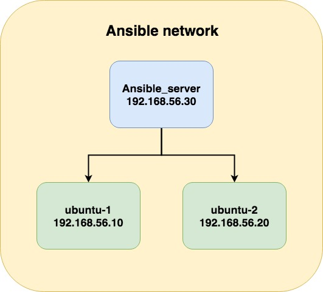

# DevOps Workshops: Introduction to Ansible
{id: introduction-to-ansible}

## Slides
{id: slides}

https://code-maven.com/ws2

## About us
{id: about-us}

* Yonit Gruber-Hazani
* Gabor Szabo
* DevOps Workshops http://devops-workshops.code-maven.com/

## About you
{id: about-you}

* Name
* Company
* What do you do
* Something interesting about you
* Have you been to our first Linux meetup

## Prerequisites for the installations
{id: installation}

* Go to [https://code-maven.com/linux](https://code-maven.com/linux) to get the step by step instructions on how to install Linux on your laptop 

## my samples structure
{id: imagefortraining}

We are going to use one server and 2 hosts to train on, 
our network will look like: 

## Starting up - configuring the structure
{id: structure}

* [install the Ansible on the ansible server](http://docs.ansible.com/ansible/latest/intro_installation.html)

We will call this server the Ansible server
for ubuntu you can use these commands: 

sudo apt-get install software-properties-common
sudo apt-add-repository ppa:ansible/ansible
sudo apt-get update
sudo apt-get install ansible

sudo apt-get update
sudo apt-get install software-properties-common

Than we want to configure the hosts file so it will know the other servers its working with:
sudo nano /etc/hosts

and add to its end:
192.168.56.10 ubuntu-1
192.168.56.20 ubuntu-2

save and exit

## Resources
{id: resources}

* [Our Meetup page](https://www.meetup.com/Code-Mavens/)
* [introduction-to-ansible 80 minutes video](https://www.ansible.com/resources/webinars-training/introduction-to-ansible)
