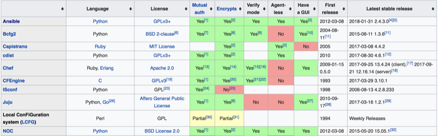

# DevOps Workshops: Introduction to Ansible
{id: introduction-to-ansible}


## About us
{id: about-us}

* [Yonit Gruber-Hazani](https://www.linkedin.com/in/yonitgruber/)
* [Gabor Szabo](https://www.linkedin.com/in/szabgab/)
* DevOps Workshops [http://devops-workshops.code-maven.com/](http://devops-workshops.code-maven.com/)

## About you
{id: about-you}

* Name
* Company
* What do you do
* Something interesting about you
* Have you been to our first Linux meetup

## Why
{id: startwithwhy}

Why are we here? 

* Scale 
* Predetermined identical configuration 
* Infrustructue as code (keep it all in git)
* Configuration versioning . (rolling back)
* Known state of the system 
* When its all in git - every change is linked to a specific request ID or bug ID


## How
{id: how}

Configuration management software - we have many options today: 

* CFEngine  - runs on C 
* Puppet    - Ruby , series of steps
* Chef      - DSL (Ruby-based) , declarative
* Ansible   - Python , series of steps (like a script), YAML files
* SaltStack - YAML files

These are just a short list, you can read comparison of all the different apps via [Puppet vs. Chef vs. Ansible vs. Salt](https://www.google.co.il/search?q=Puppet+vs.+Chef+vs.+Ansible+vs.+Salt&oq=Puppet+vs.+Chef+vs.+Ansible+vs.+Salt&aqs=chrome..69i57j0j69i60l2j0l2.914j0j1&sourceid=chrome&ie=UTF-8).

Wikipedia has a very nice [Comparison of open-source configuration management software page](https://en.wikipedia.org/wiki/Comparison_of_open-source_configuration_management_software).



## What is Ansible?
{id: whatisansible}

* It gives you a usable abstraction layer above different operating systems (all linux flavours).
* One location to manage different cloud services: AWS, GCP , Azure, Ovirt, openstack, docker , etc...
* Can be extended via python plugins.
* Agentless communication with the hosts - works through SSH.
* No daemons or database setup to use Ansible.
* Running From Source (for the config files).
* ~450 builtin [modules](http://docs.ansible.com/ansible/latest/modules_by_category.html) to manage all the system's aspects.
* 15K premade roles to download from [Ansible Galaxy](https://galaxy.ansible.com/) (Like Playbooks).

## Prerequisites for the installations
{id: installation}

Go to [https://code-maven.com/linux](https://code-maven.com/linux) to get the step by step instructions on how to install Linux on your laptop.

We will need a few hosts installed on the laptops or a few linux instances in the cloud. They need to be able to see each other via ping and ssh.


## The samples structure
{id: imagefortraining}

We are going to use one server and 2 hosts to train on, 
our network will look like: 


## Starting up - configuring the structure
{id: structure}

* [install the Ansible on the ansible server](http://docs.ansible.com/ansible/latest/intro_installation.html)

We will call this server the Ansible server
for Ubuntu you can use these commands: 

```
sudo apt-get update
sudo apt-get install software-properties-common
sudo apt-add-repository ppa:ansible/ansible
sudo apt-get update
sudo apt-get install ansible
```

Than we want to configure the hosts file so it will know the other servers its working with by name:

```
sudo nano /etc/hosts
```

and add to its end:

```
192.168.56.10 ubuntu-1
192.168.56.20 ubuntu-2
```

Save and exit.
Check by pinging the server names:

```
ping ubuntu-1
ping ubuntu-2
```

Try to ssh both of them to verify connectivity.

```
ssh ubuntu-1
ssh ubuntu-2
```


## Configuring Ansible basic files
{id: conffiles}

* Inventory file

This file describes the list of server and groups Ansible is going to work on, 
our sample structure is going to be: 

```
[virtualhosts]
ubuntu-1
ubuntu-2

```

Ansible has a default location to add its config files.
The installation for Ubuntu already created the folder and basic files, 
lets add the hosts in the default hosts file for ansible:

```
sudo nano /etc/ansible/hosts
```

and add the lines above into it.

If we do not edit the default location we can create a inventory file in our working folder and jusr call it on every run with: 

```
-i inventory.cfg
```

## Running Ansible
{id: runningansible}

there are 3 ways to run Ansible: 

* running a command: `ansible GROUP -a COMMAND`
* running a module: `ansible GROUP -m MODULE`
* running a playbook: `ansible-playbook playbook.yml`
  
[Ansible extensive list of builtin modules](http://docs.ansible.com/ansible/latest/modules_by_category.html) there are about 450~ modules in the list, some popular ones are: 

* **file**     - creates files and directories , sets permissions
* **apt/yum**  - manages packages - install, update, remove
* **service**  - manages services - stop, start, runlevel (at boot)
* **copy**     - copies files and directories
* **git**      - Deploy software (or files) from git checkouts
* **ping**     - Try to connect to host, verify a usable python and return pong on success

trying our first command:

```
ansible virtualhosts -m ping
```

this will fail since we did not setup the passwordless ssh.

```
ansible virtualhosts -m ping
SSH password:
ubuntu-1 | UNREACHABLE! => {
    "changed": false,
    "msg": "Authentication failure.",
    "unreachable": true
}
ubuntu-2 | UNREACHABLE! => {
    "changed": false,
    "msg": "Authentication failure.",
    "unreachable": true
}
```

## Creating an ssh key file and passing it to the hosts
{id: sshkey}

[Mode details instructions](https://code-maven.com/generate-and-deploy-ssh-private-public-keypair)

```
ssh-keygen
ssh-copy-id ubuntu-1
ssh-copy-id ubuntu-2
```

From now on `ssh` to the servers will be done without asking for password. 
Make sure you have `python` (aka Python 2) installed on all the servers:

```
sudo apt-get update
sudo apt-get install --no-install-recommends --assume-yes python-apt
```

Alternatively add the following to the inventory file to use Python 3 on the remote servers.

```
[virtualhosts:vars]
ansible_python_interpreter=/usr/bin/python3
```

Let's try running the Ansible command again:

```
yonit@ansible_server:/etc/ansible$ ansible virtualhosts -m ping

ubuntu-2 | SUCCESS => {
    "changed": false,
    "ping": "pong"
}
ubuntu-1 | SUCCESS => {
    "changed": false,
    "ping": "pong"
}
```

## Some simple commands
{id: morecommands}

Go ahead and try some more: 

Showing the date: 

```
ansible virtualhosts -a "date"
```

Showing the hostname: 

```
ansible virtualhosts -a "hostname"
```

Listing directories: 

```
ansible virtualhosts -a "ls -la /var"
```

## Install a package - failure
{id: installing-packages-failure}

```
$ ansible virtualhosts -m apt -a "name=nginx state=present" -b
```

The `apt` command will fail - untill now we run everything with our user.

To run commands as root we need to give passwordless sudo permission for the user we connect as.

## Passwordless sudo
{id: passwordless-sudo}

```
ssh ubuntu-1
sudo nano /etc/sudoers
```

and add this line:

```
yonit  ALL = (ALL) NOPASSWD: ALL
```

Repeat for all the servers. 

Another option would be copying the content of my `.ssh/authorized_keys` in the servers to `/root/.ssh/authorized_keys`
which would allow me to connect from my user directly to the root user on the remote servers.


## Install a package
{id: installing-packages}

Let's try again: 

```
$ ansible virtualhosts -m apt -a "name=nginx state=present" -b

ubuntu-2 | SUCCESS => {
    "cache_update_time": 1521409853,
    "cache_updated": false,
    "changed": true,
    "stderr": "",
    "stderr_lines": [],
    "stdout": "Reading package lists...\nBuilding dependency tree...\nReading state information...\n
              The following additional packages will be installed:\n  fontconfig-config fonts-dejavu-core
              libfontconfig1 libgd3 libjbig0\n  libjpeg-turbo8 libjpeg8 libnginx-mod-http-geoip\n
              libnginx-mod-http-image-filter libnginx-mod-http-xslt-filter\n  libnginx-mod-mail
              libnginx-mod-stream libtiff5 libwebp6 libxpm4 nginx-common\n  nginx-core\nSuggested packages:\n
              libgd-tools fcgiwrap nginx-doc ssl-cert\nThe following NEW packages will be installed:\n
              fontconfig-config fonts-dejavu-core libfontconfig1 libgd3 libjbig0\n  libjpeg-turbo8
              libjpeg8 libnginx-mod-http-geoip\n  libnginx-mod-http-image-filter libnginx-mod-http-xslt-filter\n
              libnginx-mod-mail libnginx-mod-stream libtiff5 libwebp6 libxpm4 nginx\n  nginx-common nginx-core\n
              0 upgraded, 18 newly installed
```

Let's check from one of the servers:

```
yonit@ubuntu-2:~$ service nginx status

   nginx.service - A high performance web server and a reverse proxy server
   Loaded: loaded (/lib/systemd/system/nginx.service; enabled; vendor preset: enabled)
   Active: active (running) since Mon 2018-03-19 00:15:24 IST; 1min 1s ago
     Docs: man:nginx(8)
```

You can try to access it: 

```
$ curl http://ubuntu-1
```

## removing a package
{id: removingapackage}

Testing before running: 

```
ansible virtualhosts -C -m service -a "name=nginx state=stopped" -b
```

will test the command without actualy running it. 

we can remove the nginx package with these commands, 

stopping:

```
ansible virtualhosts -m service -a "name=nginx state=stopped" -b

ubuntu-1 | SUCCESS => {
    "changed": true,
    "name": "nginx",
    "state": "stopped",
    "status": {
        "ActiveEnterTimestamp": "Tue 2018-03-20 23:22:34 IST",
        "ActiveEnterTimestampMonotonic": "2363436511",
        "ActiveExitTimestamp": "Tue 2018-03-20 23:20:30 IST",
        

```

and removing:

```
ansible virtualhosts -m apt -a "name=nginx state=absent purge=yes autoremove=yes" -b

ubuntu-2 | SUCCESS => {
    "changed": true,
    "stderr": "",
    "stderr_lines": [],
    "stdout": "Reading package lists...\nBuilding dependency tree...\nReading state information...\n
```

## Shell command
{id: shell}

When running the ad-hoc command line on with ansible, it does not go through shell.
So some parsing or rediredting might not work.
To fix that you can use the shell module:

```
$ ansible virtualhosts -m shell -a "hostname ; date ; uptime ; free" 

ubuntu-2 | SUCCESS | rc=0 >>
ubuntu-2
Mon Mar 19 01:50:03 IST 2018
 01:50:03 up  3:36,  2 users,  load average: 0.00, 0.00, 0.00
              total        used        free      shared  buff/cache   available
Mem:        1012448       85280      415244        3276      511924      775784
Swap:        483800           0      483800

ubuntu-1 | SUCCESS | rc=0 >>
ubuntu-1
Mon Mar 19 01:50:03 IST 2018
 01:50:03 up  7:49,  1 user,  load average: 0.00, 0.00, 0.00
              total        used        free      shared  buff/cache   available
Mem:        1012448       79836      422828        3264      509784      781300
Swap:        483800           0      483800
```

One last module to check is the setup module which lists tons of information on our servers: 

```
$ ansible virtualhosts -m setup

sample output:
        "ansible_distribution": "Ubuntu",
        "ansible_distribution_file_parsed": true,
        "ansible_distribution_file_path": "/etc/os-release",
        "ansible_distribution_file_variety": "Debian",
        "ansible_distribution_major_version": "17",
        "ansible_distribution_release": "artful",
        "ansible_distribution_version": "17.10",
```

```
ansible virtualhosts -m setup |more |grep -i ubuntu
ubuntu-1 | SUCCESS => {
        "ansible_distribution": "Ubuntu",
        "ansible_fqdn": "ubuntu-1",
        "ansible_hostname": "ubuntu-1",
            "description": "Ubuntu 17.10",
            "id": "Ubuntu",
        "ansible_nodename": "ubuntu-1",
```

## Playbooks - combining tasks
{id: playbookintro}

Playbook is a collection of tasks that we want to group together. 

lets review nginx install in a playbook format: `nginx_install.yml`

```
---
- hosts: virtualhosts
  become: true
  tasks:
    - name: install nginx
      apt:
        name: nginx
        state: latest
    - name: Setup nginx conf
      template:
        src=nginx.conf.tpl
        dest=/etc/nginx/nginx.conf
      notify: restart nginx
  handlers:
    - name: restart nginx
      service:
        name=nginx
        state=restarted
```

our template file is another file in the same directory that has the ubuntu nginx.conf content and is called: `nginx.conf.tpl`

```
user www-data;
worker_processes auto;
pid /run/nginx.pid;
include /etc/nginx/modules-enabled/*.conf;
events {
	worker_connections 768;
	# multi_accept on;
}
http {
	##
	# Basic Settings
	##
	sendfile on;
	tcp_nopush on;
	tcp_nodelay on;
	keepalive_timeout 65;
	types_hash_max_size 2048;
	# server_tokens off;
	# server_names_hash_bucket_size 64;
	# server_name_in_redirect off;
	include /etc/nginx/mime.types;
	default_type application/octet-stream;
	##
	# SSL Settings
	##
	ssl_protocols TLSv1 TLSv1.1 TLSv1.2; # Dropping SSLv3, ref: POODLE
	ssl_prefer_server_ciphers on;
	##
	# Logging Settings
	##
	access_log /var/log/nginx/access.log;
	error_log /var/log/nginx/error.log;
	##
	# Gzip Settings
	##
	gzip on;
	gzip_disable "msie6";
	# gzip_vary on;
	# gzip_proxied any;
	# gzip_comp_level 6;
	# gzip_buffers 16 8k;
	# gzip_http_version 1.1;
	# gzip_types text/plain text/css application/json application/javascript text/xml application/xml application/xml+rss text/javascript;
	##
	# Virtual Host Configs
	##
	include /etc/nginx/conf.d/*.conf;
	include /etc/nginx/sites-enabled/*;
}
```

## running the playbook
{id: runningplaybook}

the command to run the playbook is a little different than the regular run command:

`ansible-playbook nginx_install.yml`

output would be: 

```
PLAY [virtualhosts] ****************************************************************************************************************************************************************

TASK [Gathering Facts] *************************************************************************************************************************************************************
ok: [ubuntu-1]
ok: [ubuntu-2]

TASK [install nginx] ***************************************************************************************************************************************************************
changed: [ubuntu-2]
changed: [ubuntu-1]

TASK [Setup nginx conf] ************************************************************************************************************************************************************
changed: [ubuntu-2]
changed: [ubuntu-1]

RUNNING HANDLER [restart nginx] ****************************************************************************************************************************************************
changed: [ubuntu-1]
changed: [ubuntu-2]

PLAY RECAP *************************************************************************************************************************************************************************
ubuntu-1                   : ok=4    changed=3    unreachable=0    failed=0
ubuntu-2                   : ok=4    changed=3    unreachable=0    failed=0
```

playing the playbook again wont do anything if the state of the services and file is already identical:

```
yonit@ansible_server:~/ansible$ ansible-playbook nginx_install.yml

PLAY [virtualhosts] ****************************************************************************************************************************************************************

TASK [Gathering Facts] *************************************************************************************************************************************************************
ok: [ubuntu-2]
ok: [ubuntu-1]

TASK [install nginx] ***************************************************************************************************************************************************************
ok: [ubuntu-2]
ok: [ubuntu-1]

TASK [Setup nginx conf] ************************************************************************************************************************************************************
ok: [ubuntu-2]
ok: [ubuntu-1]

PLAY RECAP *************************************************************************************************************************************************************************
ubuntu-1                   : ok=3    changed=0    unreachable=0    failed=0
ubuntu-2                   : ok=3    changed=0    unreachable=0    failed=0
```

## adding vars to the play
{id: vars}

Variables can be defines in many locations, and we can get them from the facts gathering stage as well. 

lets add some content to the nginx servers, create a file called `index.html.tpl` with the content:

```
<!DOCTYPE html>
<html>
<head>
<title>Welcome to ubuntu-1</title>
<style>
    body {
        width: 35em;
        margin: 0 auto;
        font-family: Tahoma, Verdana, Arial, sans-serif;
    }
</style>
</head>
<body>
<h1>Welcome to ubuntu-1</h1>
</body>
</html>
```

and run the playbook again: 

```
yonit@ansible_server:~/ansible$ ansible-playbook nginx_install.yml

PLAY [virtualhosts] ****************************************************************************************************************************************************************

TASK [Gathering Facts] *************************************************************************************************************************************************************
ok: [ubuntu-1]
ok: [ubuntu-2]

TASK [install nginx] ***************************************************************************************************************************************************************
ok: [ubuntu-1]
ok: [ubuntu-2]

TASK [Setup nginx conf] ************************************************************************************************************************************************************
ok: [ubuntu-1]
ok: [ubuntu-2]

TASK [add index.html file] *********************************************************************************************************************************************************
changed: [ubuntu-2]
changed: [ubuntu-1]

PLAY RECAP *************************************************************************************************************************************************************************
ubuntu-1                   : ok=4    changed=1    unreachable=0    failed=0
ubuntu-2                   : ok=4    changed=1    unreachable=0    failed=0
```

now lets see it: 

```
yonit@ansible_server:~/ansible$ curl http://ubuntu-2/
<!DOCTYPE html>
<html>
<head>
<title>Welcome to ubuntu-1</title>
<style>
    body {
        width: 35em;
        margin: 0 auto;
        font-family: Tahoma, Verdana, Arial, sans-serif;
    }
</style>
</head>
<body>
<h1>Welcome to ubuntu-1</h1>
</body>
</html>
```

## more vars
{id: morevars}

To get the index files to display the name of the server i need to use a variable in the template

lets rename the index.html file: `mv index.html.tpl index.html.j2`

and edit the playbook, change these line: 

```
src=index.html.tpl
to 
src=index.html.j2
```

and lets slightly change index.html.j2:

```
<!DOCTYPE html>
<html>
<head>
	<title>Welcome to {{ ansible_hostname }}</title>
<style>
    body {
        width: 35em;
        margin: 0 auto;
        font-family: Tahoma, Verdana, Arial, sans-serif;
    }
</style>
</head>
<body>
	<h1>Welcome to {{ ansible_hostname }}</h1>
</body>
</html>
```

run the playbook: 

```
yonit@ansible_server:~/ansible$ ansible-playbook nginx_install.yml

PLAY [virtualhosts] ****************************************************************************************************************************************************************

TASK [Gathering Facts] *************************************************************************************************************************************************************
ok: [ubuntu-1]
ok: [ubuntu-2]

TASK [install nginx] ***************************************************************************************************************************************************************
ok: [ubuntu-1]
ok: [ubuntu-2]

TASK [Setup nginx conf] ************************************************************************************************************************************************************
ok: [ubuntu-1]
ok: [ubuntu-2]

TASK [add index.html file] *********************************************************************************************************************************************************
changed: [ubuntu-2]
changed: [ubuntu-1]

PLAY RECAP *************************************************************************************************************************************************************************
ubuntu-1                   : ok=4    changed=1    unreachable=0    failed=0
ubuntu-2                   : ok=4    changed=1    unreachable=0    failed=0
```

and now: 

```
yonit@ansible_server:~/ansible$ curl http://ubuntu-2/
<!DOCTYPE html>
<html>
<head>
	<title>Welcome to ubuntu-2</title>
<style>
    body {
        width: 35em;
        margin: 0 auto;
        font-family: Tahoma, Verdana, Arial, sans-serif;
    }
</style>
</head>
<body>
	<h1>Welcome to ubuntu-2</h1>
</body>
</html>
```


## Resources
{id: resources}

* [Our Meetup page](https://www.meetup.com/Code-Mavens/).
* [Introduction to Ansible - 80 minutes video](https://www.ansible.com/resources/webinars-training/introduction-to-ansible).
* [Ansible for DevOps](https://leanpub.com/ansible-for-devops) by Jeff Geerling.
* [Ansible book](https://leanpub.com/ansible-book/c/devops-workshop-2) by Gabor. (now free)

