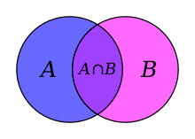

# sets

* set

* Sets in Python are used when we are primarily interested in operations that we know from the [set theory](https://en.wikipedia.org/wiki/Set_theory).
* See also the [Venn diagrams](https://en.wikipedia.org/wiki/Venn_diagram).
* In day to day speach we often use the word "group" instead of "set" even though they are not the same.
* What are the common elements of two set (two groups).
* Is one group (set) the subset of the other?
* What are all the elements that exist in both groups (sets)?
* What are the elements that exist in exactly one of the groups (sets)?

