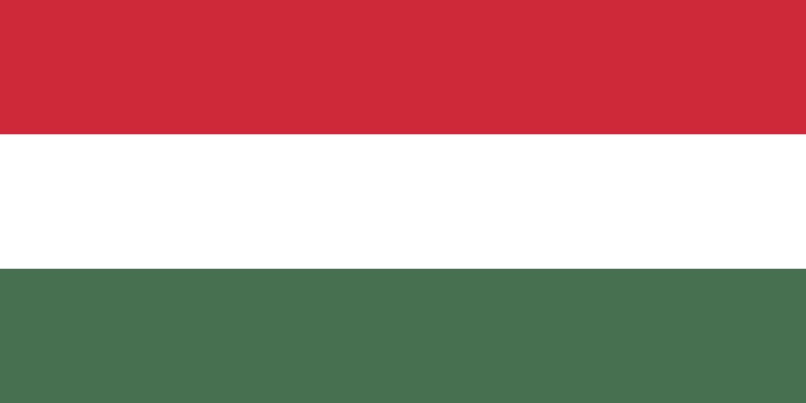

# Flag of Hungary

* Using `path` based on the version on the [Wikipedia](https://en.wikipedia.org/wiki/Flag_of_Hungary)



A `path` can be used to define complex shapes, but in this case the shapes are rather simple. 3 rectangles.
In the path element we can provide commands.

* `M` means move to (x,y) coordinates. So the first line say Move to coordinates (0, 0).
* `H` means move horizontally to the x coordinate. So H1200 means move to (1200, 0).
* `V` means move vertically to the y coordinate So V200 means to move (1200, 200).
* `H0` means move to the x=0 coordinate.

Each path element also has a color associated with it in the `fill` attribute.

* Using `rect` In this solution we draw 3 rectangles of the appropriate `width`, `height` placing them at various `y` coordinates (`x` defaults to 0) and filling them with the appropriate color.



