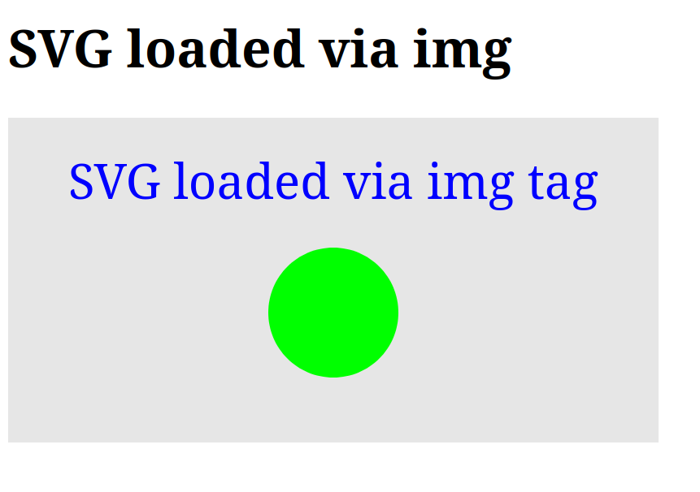

# SVG loaded in an img tag

In many cases it is probbably better to separate the SVG content from the HTML itself with all the usual pro and contra reasons.

Pro:
* separating the SVG file allows the developer to vide and edit it separately
* browsers can cache the svg image and this if the same image is reused on multiple page the browser does not need to load the data several times.

Contra:
* Browsers need to make a separate request to load each SVG file.

Move the SVG part to a separate file with `.svg` extension:



In the HTML document refer to the file via an `img` tag:



The page is rendered like this:

## SVG loaded in an object tag

Certain features do not work when using the `img` tag to display an SVG file, specifically the embedding of other images in the SVG file using the `image` tag that we'll see later. Using `object` solves this problem.

<object data="../examples/load-svg-via-img-tag.svg" type="image/svg+xml"></object>

## SVG loaded in an iframe

<iframe src="load-svg-via-img-tag.svg"></iframe>

