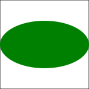

# Ellipse



* `rx` is the horizontal radius (so half of the width of the ellipe).
* `ry` is the vertical radious (so half of the hight of the ellipse).
* `cx` is the horizontal center of the ellipse.
* `cy` is the vertical center of the ellipse.

