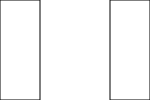

# Rectangles

## No color (no fill)

We can create a rectangle exactly the same width and height as the full image and wihout setting the `fill` attribute it will be black:



## Set the width and height as a percentage



## Violet - setting the color in 4 different ways



* `fill` sets the background color of a shape, e.g. a rectangle.

## White rectangle with border



* `fill` sets the background color.
* `stroke` sets the color of the border.
* `stroke-width` sets the width (in pixels) of th border.

* We can also use `style` to set all 3 attributes.

