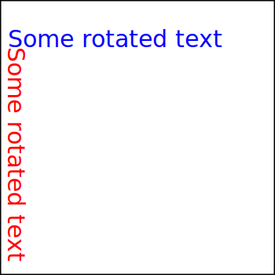
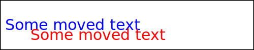

# Rotate the whole text with transform



* `transform` `rotate(angle [, cx, cy])`

Rotates the element by `angle` degrees clockwise. If you provide `cx` and `cy`, it rotates around that point; otherwise, it rotates around the origin `(0,0)`.



* `translate(tx [, ty])`

Moves (shifts) the element by `tx` units horizontally and `ty` units vertically. If `ty` is omitted, it's assumed to be 0.

