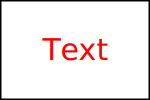

# Text



* x - The start of the text. Defaults to 0.
* y - The start of the text. Defaults to 0.
* dx - Delta
* dy - Delta
* rotate
* textLength
* lengthAdjust

* text-anchor
    * start
    * middle
    * end

