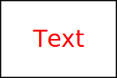
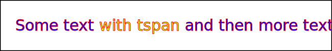

# Text



## Text with stroke (border) and no fill (color)



* x - The start of the text. Defaults to 0.
* y - The start of the text. Defaults to 0.
* dx - Delta 
* dy - Delta
* rotate
* textLength
* lengthAdjust

## tspan to add style to part of the text



* text-anchor
    * start
    * middle
    * end
