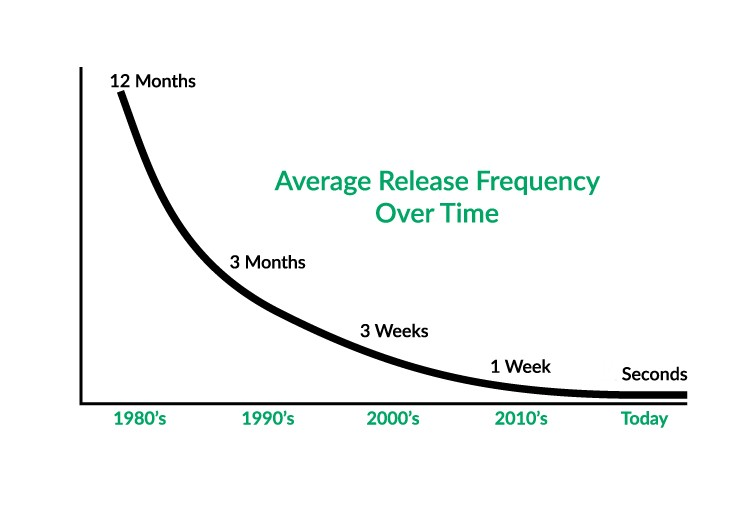

# Introduction to DevOps
{id: introduction-to-devops}

## Goal
{id: goal}

* What is our goal?
* Why are we here?

The overall goal of the companies is to create more value to customers in order to get more value out of it.

If the same amount received today has a higher value than a year from now. So "sooner" has a higher value than later.

## Business needs for change
{id: business-needs-for-change}

* Reduce time to market
* Increase feature throughput

* Decrease cost
* Increase quality

## Value stream
{id: values-stream}

* small batch size
* reducing work in process (WIP)  (as that only generates cost)
* preventing rework (reducing the number and seriousness of defects)
* constantly optimizing our system

## Flow
{id: flow}

* Requirements
* Design
* Development
* InfoSec
* QA
* Operations

## Reduce Multitasking
{id: reduce-multitaskin}

Drawing thats shows how much time we spend on actual work vs. The switching cost for 1-5 parallel tasks.

(source http://flowa.fi/blog/2014/10/23/games-to-learn-kanban-why-and-how.html )

## Multitasking Exercise
{id: multitasking-exercise}

Exercise: Write down 3 sets of values while measuring the time.

First write down the arabic numbers 0123456789, them letters  abcdefghij, and then the roman numbers:

I II III IV V VI VII VIII IX X
In the next round write the same ones down but this time start by writing down the first value of each, then the second value of each.

## Lead time
{id: lead-time}

* Time to complete a task from requirement to use by client. 
* Lead tine: from time of check-in till use of the code. 
* Reduce WIP: Kanban board can be used. 
* Reduce batch size. 

## Daily feedback meetings
{id: daily-feedback-meetings}

* What did you finish yesterday?
* What will you finish today?
* What's blocking you? ( What's your red flag? )

Fast development and stable software are traditionally orthogonal to each other.

However research shows that using the right approach one can achieve fast-paced development and stable software.  (Research ?)

A special case of the above mentioned problem is the tension between developers and operations.
Traditionally Developers are more interested in creating software, using the latest libraries etc.
Operations are required to provide stability for the production system. Stability requires little or no changes to the software stack. (e.g. OS, third-party library, code)

## Techniques
{id: techniques}

* Fast feedback loop
* Test automation
* Continuous Integration (CI)
* Continuous Deployment (CD)
* Code reviews
* Pair programming
* Monitoring

## Greenfield projects VS brownfield projects
{id: brownfield-projects}

* Technical debt
* Legacy code
* Unsupported platform

## Features
{id: features}

* Testebility
* Deployability

## The DevOps transformation process
{id: devops-transformation-process}

* Pick the value stream to be the first to convert

## Resilient teams
{id: resilient-teams}

* Chaos Monkey of Netflix
* Randomly kill processes and compute servers in production to see how the monitoring system and the whole team reacts
* Do this often during work hours and reduce the risk of such thing happening during the nights. 

## Release frequency
{id: release-frequency}

(source https://medium.com/data-ops/releasing-new-analytics-every-second-fc5fefd92360 )

