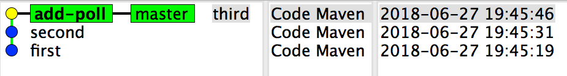
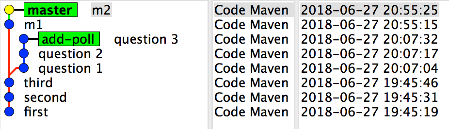

# Git Local
{id: git-local}


## Create server repository
{id: create-server-repository}

```
$ mkdir git-demo/
$ cd git-demo
$ git init

Initialized empty Git repository in /Users/gabor/work/git/git-demo/
```


## Configure user
{id: configure-user}

```
$ vim .git/config
```

add:


```
[user]
	name = Code Maven
	email = me@code-maven.com
```


## Add file
{id: add-file}


```
$ vim README
$ git add .
$ git commit -m "first"
[master (root-commit) ef28fcf] first
 1 file changed, 1 insertion(+)
 create mode 100644 README
```


## Update file
{id: update-file}

```
$  vim README
$  git add .
$  git commit -m "second"
[master 398a810] second
 1 file changed, 1 insertion(+)

$  vim README
$  git add .
$  git commit -m "third"
[master 33bb6a4] third
 1 file changed, 1 insertion(+)
```


## First 3 commits
{id: first-3-commits}


## Create branch
{id: create-branch}

```
$ git branch add-poll
```


## Switch to branch
{id: switch-to-branch}

```
$ git checkout add-poll
```



## Make changes on the branch
{id: make-changes-on-branch}


```
$  vim POLL
$  git add .
$  git commit -m "question 1"
[add-poll dc940b9] question 1
 1 file changed, 1 insertion(+)
 create mode 100644 POLL

$  vim POLL
$  git add .
$  git commit -m "question 2"
[add-poll 869018d] question 2
 1 file changed, 1 insertion(+)

$  vim POLL
$  git add .
$  git commit -m "question 3"
[add-poll e0dbe09] question 3
 1 file changed, 1 insertion(+)
```


## Switch to master
{id: switch-to-master}

```
$ git checkout master
```

The file POLL has disappeared from the working directory.


Now the word <b>master</b> is bold.


## Add changes to master
{id: add-changes-to-master}

```
$  vim MASTER
$  git add .
$  git commit -m m1
[master 8f78730] m1
 1 file changed, 1 insertion(+)
 create mode 100644 MASTER

$  vim MASTER
$  git add .
$  git commit -m m2
[master 591a601] m2
 1 file changed, 1 insertion(+)
```



## Switch to branch
{id: switch-to-branch-2}

```
$ git checkout add-poll
```


The file MASTER disappers. The file POLL reappears.


Now the word **add-poll** is bold.


## Another change on the branch
{id: another-change-on-the-branch}

```
$  vim POLL
$  git add .
$  git commit -m "question 4"
[add-poll d00e2a8] question 4
 1 file changed, 1 insertion(+)
```


The add-poll branch is now displayed higher because it had the most recent commit.


## Merge branch to master
{id: merge-branch-to-master}


```
$ git checkout master
```


```
$  git merge add-poll
Merge made by the 'recursive' strategy.
 POLL | 4 ++++
 1 file changed, 4 insertions(+)
 create mode 100644 POLL
```


```
Merge branch 'add-poll'

# Please enter a commit message to explain why this merge is necessary,
# especially if it merges an updated upstream into a topic branch.
#
# Lines starting with '#' will be ignored, and an empty message aborts
# the commit.
```


## Shared feature branch
{id: shared-feature-branch}

```
A: $ git checkout -b feature
A: $ git push -u origin feature

B: $ git chechkout master
B: $ git pull
B: $ git branch feature origin/feature
```


* Every developer works on the "feature" branch.
* Every developer create a small branch from the "feautre", commits there. pushes it out. Send PR to the feature.


