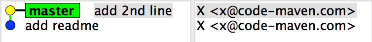
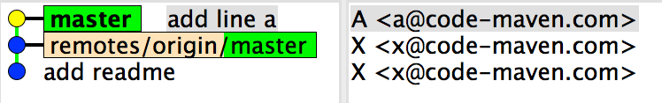
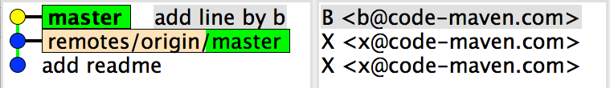
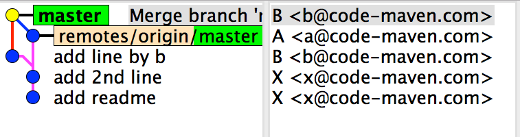
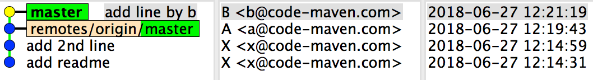
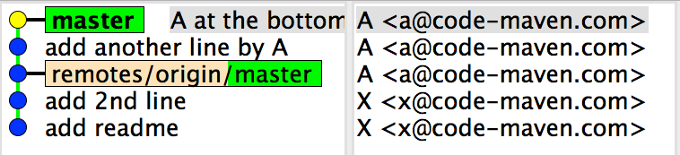
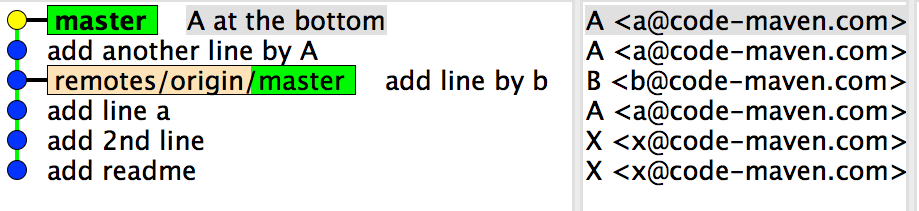

# Git Workflows
{id: git-workflows}

## A collection of workflows and issues
{id: git-workflows}

* Individual developer, local changes only

Change, commit, push  - not very exciting.

* Individual developer, local changes only, using stash for small interruptions

This time the `git stash pop` might need to handle merge conflicts.

* Individual developer, both local and remote changes (e.g. a pull-request was accepted using the web site of GitHub)

Need to pull before push. One might need to merge or rebase and one might need to handle conflicts.

* Individual developer, working in branches

* A single main developer + multiple helpers

The latter forking the repository and sending pull-requests

* Multiple developers on the same repo - single main branch

* Multiple developers on the same repo - development branches and Pull-requests


## Workflow for individuals
{id: workflow-for-individuals}

* main only
* stash for small interruptions
* feature branches (merge or rebase?)


## Git workflows
{id: workflows}

* Centralized
* Feature Branch
* Gitflow
* Forking Workflow
* [Atlassian git workflows](https://www.atlassian.com/git/tutorials/comparing-workflows)


## Centralized Workflow
{id: centralized-workflow}

* Single remote repository.
* Single master branch.


## Repo start
{id: repo-start}



* A: `$ git clone ssh://user@host/path/to/repo.git`
* B: `$ git clone ssh://user@host/path/to/repo.git`


## Developer A
{id: repo-add-by-a}


* A: make changes, commits `$ git push`


## Developer B
{id: repo-add-by-b}



**B: make changes, commits**
`$ git push` fails with


```
error: failed to push some refs to '/path/to/repo.git'
hint: Updates were rejected because the tip of your current branch is behind
hint: its remote counterpart. Merge the remote changes (e.g. 'git pull')
hint: before pushing again.
hint: See the 'Note about fast-forwards' in 'git push --help' for details.
```


## git pull (fetch+merge)
{id: git-pull-merge}


B: `$ git pull`

```
Merge branch 'master' of /Users/gabor/work/git/git-server

# Please enter a commit message to explain why this merge is necessary,
# especially if it merges an updated upstream into a topic branch.
#
# Lines starting with '#' will be ignored, and an empty message aborts
# the commit.
```



## Forgetting to rebase
{id: forgetting-to-rebase}

* If you executed a **git pull** and forgot to add **--rebase** it can be still fixed.
* If you have not pushed it out yet: `$ git reset HEAD~1 --hard`
* Then you can `$ git pull --rebase`


## git pull --rebase (fetch+rebase)
{id: git-pull-rebase}

* B: `$ git pull --rebase`



* B: `$ git push`


## Resolve conflicts
{id: resolve-conflicts}

* A makes changes to the same area where B is making changes.
* B: `git push` rejected
* B: `git pull --rebase`





```
remote: Counting objects: 3, done.
remote: Total 3 (delta 0), reused 0 (delta 0)
Unpacking objects: 100% (3/3), done.
From /Users/gabor/work/git/git-server
   3f6fad3..126d1f8  master     -> origin/master
First, rewinding head to replay your work on top of it...
Applying: add another line by A
Applying: A at the bottom
Using index info to reconstruct a base tree...
M	README
Falling back to patching base and 3-way merge...
Auto-merging README
CONFLICT (content): Merge conflict in README
error: Failed to merge in the changes.
Patch failed at 0002 A at the bottom
Use 'git am --show-current-patch' to see the failed patch

Resolve all conflicts manually, mark them as resolved with
"git add/rm &lt;conflicted_files&gt;", then run "git rebase --continue".
You can instead skip this commit: run "git rebase --skip".
To abort and get back to the state before "git rebase", run "git rebase --abort".
```


## Conflicting patch
{id: conflicting-patch}

```
$ git am --show-current-patch

commit 6297d04c97c29937bcf540cf22312ec3900ae33e (master)
Author: A &lt;a@code-maven.com&gt;
Date:   Wed Jun 27 15:53:23 2018 +0300

    A at the bottom

diff --git a/README b/README
index 31d0540..a8a7095 100644
--- a/README
+++ b/README
@@ -2,3 +2,4 @@ Add line by a
 Another line by A
 Readme file
 2nd line
+line added by A
```


## Conflicting file
{id: conflict-in-file}


## Resolve conflicting file
{id: resolve-conflict-in-file}


* `git status`


```
rebase in progress; onto 126d1f8
You are currently rebasing branch 'master' on '126d1f8'.
  (fix conflicts and then run "git rebase --continue")
  (use "git rebase --skip" to skip this patch)
  (use "git rebase --abort" to check out the original branch)

Unmerged paths:
  (use "git reset HEAD &lt;file&gt;..." to unstage)
  (use "git add &lt;file&gt;..." to mark resolution)

	both modified:   README

no changes added to commit (use "git add" and/or "git commit -a")
```


## Continue rebase
{id: continue-rebase}

```
$ git add .
        no need to commit that changes!!!
$ git rebase --continue 
```




