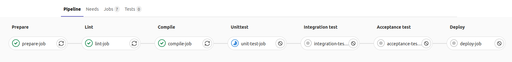

# Define stages

* If the 3 standard stages are not good for you, you can defined your own stage-names and order them as you like
* Stage names are free text and can includes spaces.

```yaml
{{#include ../examples/pipelines/define-stages/.gitlab-ci.yml}}
```




