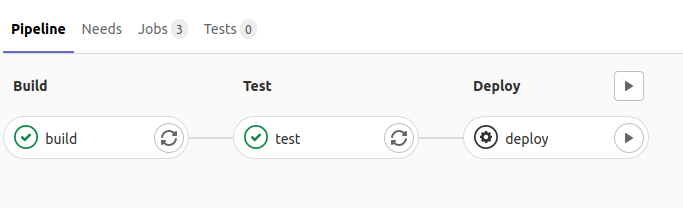

# Manual interaction


* [Manual interaction](https://docs.gitlab.com/ee/ci/pipelines/#add-manual-interaction-to-your-pipeline)

* Select the `gear` icon, type in the variable: `name` and a value. Then let it run.

```yaml
{{#include ../examples/pipelines/manual-interaction/.gitlab-ci.yml}}
```




