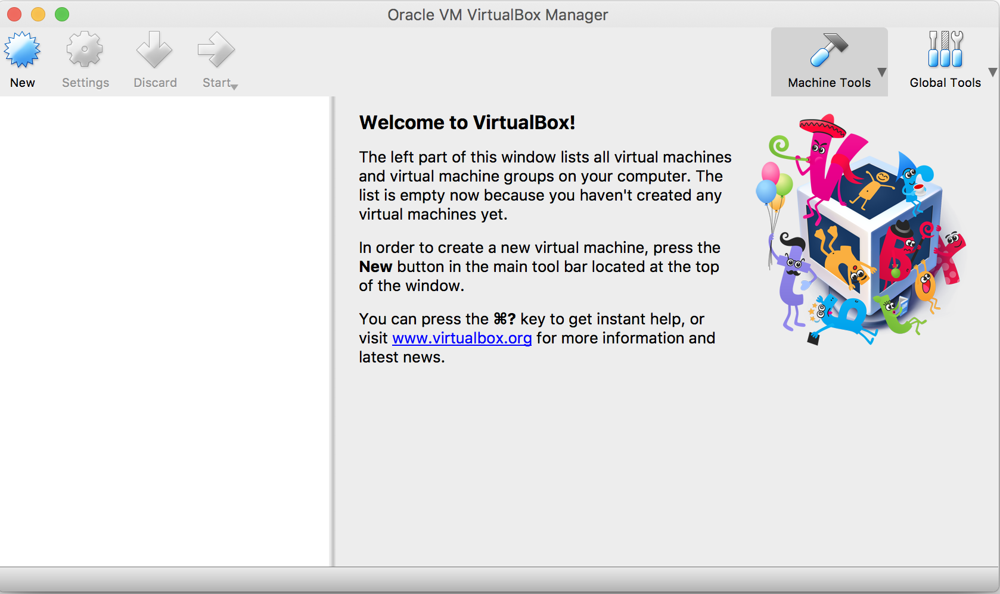
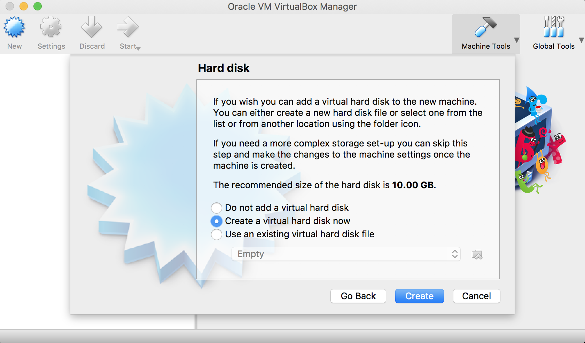
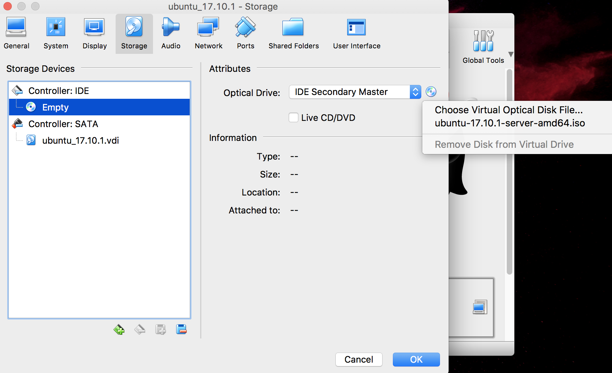
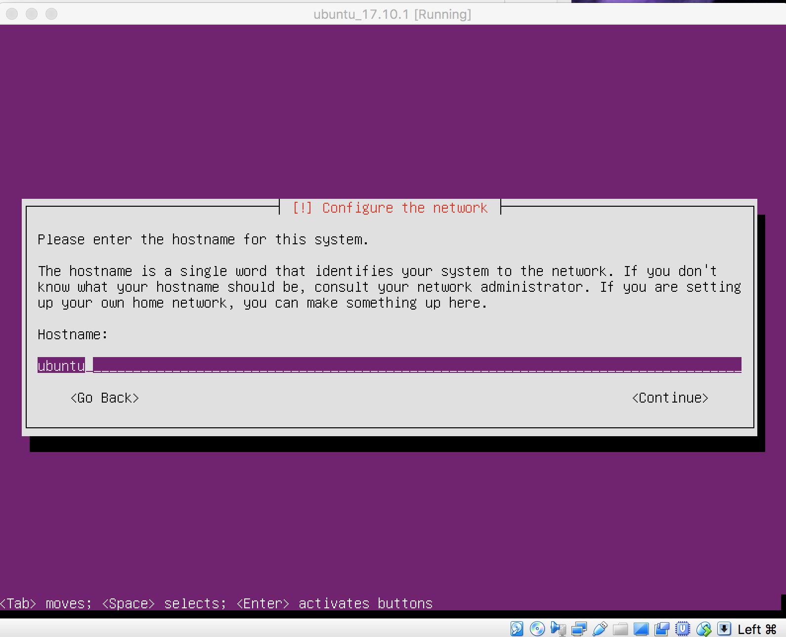
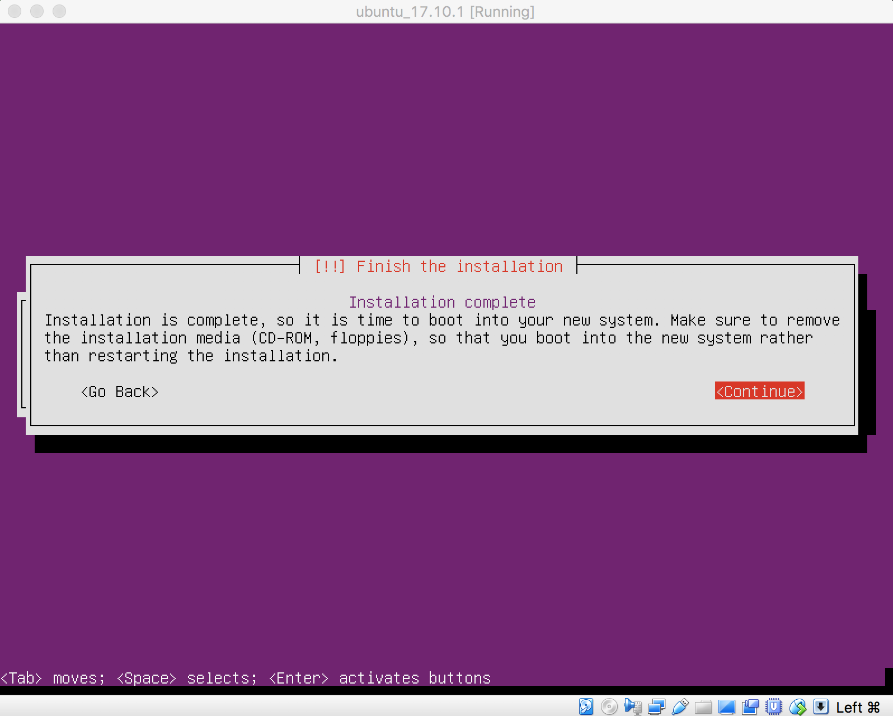
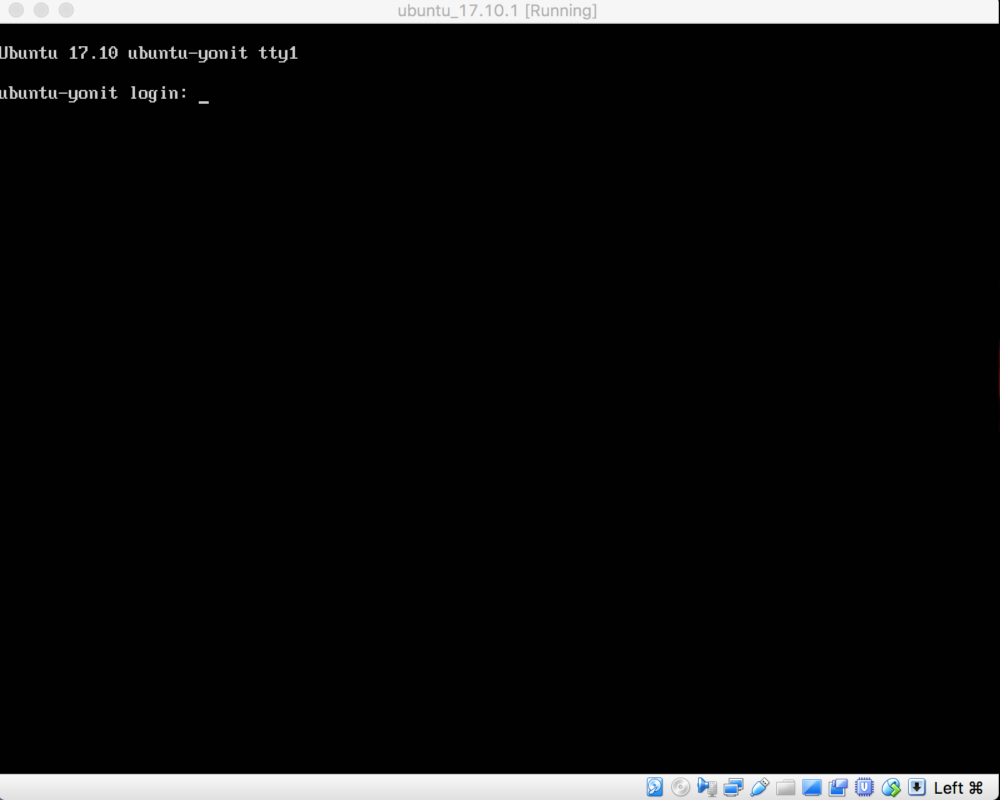
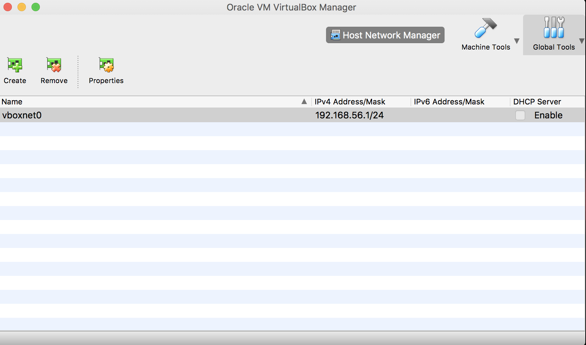
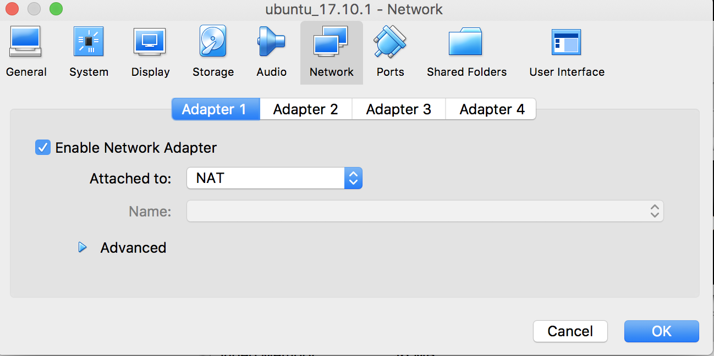
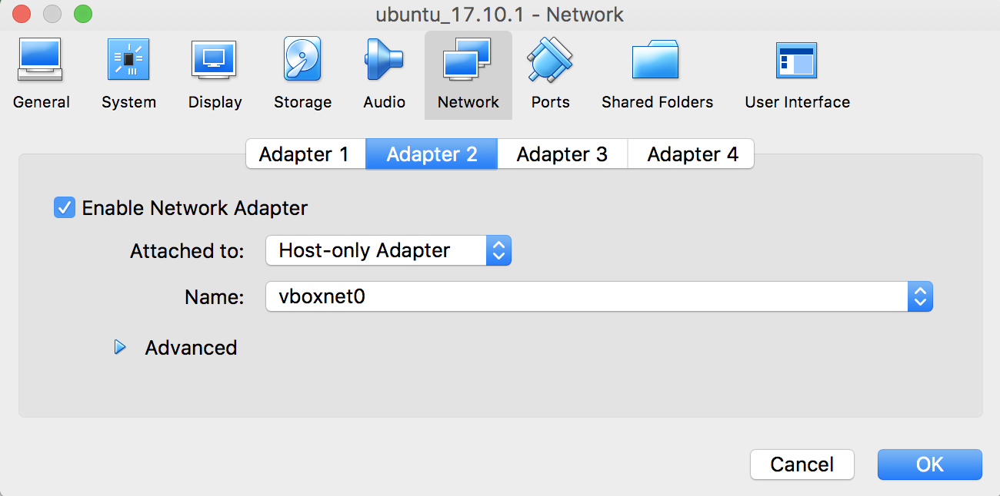

# Linux as a Virtual Environment
{id: index}

## Slides
{id: slides}

https://code-maven.com/ws1

## About us
{id: about-us}

* Yonit Gruber-Hazani
* Gabor Szabo
* DevOps Workshops http://devops-workshops.code-maven.com/

## About you
{id: about-you}

* Name
* Company
* What do you do
* Something interesting about you

## Prerequisites for the installations
{id: installation}

* Download [VirtualBox](https://www.virtualbox.org/).
* Install VirtualBox.
* Download an ISO image of a Linux distribution.
* Latest [Ubuntu Server](https://www.ubuntu.com/download/server) - 17.10.1


## Why Linux?
{id: why-linux}

* All the major players use it.
* [Hosting provider server count](https://www.netcraft.com/internet-data-mining/hosting-provider-server-count/)
* [Netcraft web server survey](https://news.netcraft.com/archives/2018/01/19/january-2018-web-server-survey.html)


## What is Linux?
{id: what-is-linux}

* The kernel
* The Operating System - thousands of programs
* The Distribution - a group effort


## Linux Distributions
{id: linux-distributions}

* Debian
* Ubuntu
* Mint
* Fedora
* RedHat
* CentOS
* ... [DistroWatch](https://distrowatch.com/)

## What is BSD?
{id: bsd}

* FreeBSD
* NetBSD
* OpenBSD

## What are Linux distributions?
{id: what-are-linux-distributions}

* Collection of packages
* Linux kernel
* Editors
* Web server
* Database server
* etc.

## Configure Virtualbox
{id: configure-virtualbox}

* Open VirtualBox - Press the "new" button on the left



## Configure Virtualbox - 2
{id: configure-virtualbox-2}

* If you type in the name "ubuntu_17.10.1" it will setup the type to linux and the version to ubuntu 64-bit for you if not, you can do that yourself.


## Configure Virtualbox - 3
{id: configure-virtualbox-3}

* Continue the setup with the values VirtualBox is suggesting for you.
* Memory size: 1024 Mb.
* Hard disk: Create a virtual hard disk now (Recommended size is 10 Gb).
* Hard disk file type: VDI (VirtualBox Disk Image).
* Storage on physical hard disk: Dynamically allocated.
* File location and size: `ubuntu` is fine. 10 Gb.




## Configure Virtualbox - 4
{id: configure-virtualbox-4}

* Right-click on the icon of your new server and select "Settings".
* Select the "Storage" section.
* Click on the "empty" CD icon and select the Ubuntu .iso file you have downloaded before.
* After saving this setup you can click on "Start" to launch the new Linux machine.



## Set up Linux
{id: setup-linux}

* Start the installation of Ubuntu - Select the defaults
* Your preferred language: English.
* "Install Ubuntu Server"
* Select a language - English
* Your location: "Untied States"
* Detect keyboard?  No
* Configure the keyboards: English (US)
* Keyboard layout: English (US)

## Set up Linux - hostname
{id: setup-linux-hostname}

* When you get to the hostname section choose whatever you like.
* "ubuntu" is fine for this installation.



## Set up Linux - user
{id: setup-linux-user}

* Type in your full name.
* Select a username for yourself.
* Type in a good password. (twice)
* Home directory encryption: No
* Timezone (it decided Asia/Jerusalem for me): Yes
* Partition disks: select "Guided - use entire disk"  (no LVM)
* SCSI3 ...
* Write the changes to disks?  YES!!!!
* ...
* Configure the package manager proxy (leave it empty)
* ...
* Upgrades of the system: "No automatic updates"
* Software selection: don't select anything now.
* ...
* Install the GRUB boot loader on a hard disk - YES
* ...

## Set up Linux - complete
{id: setup-linux-complete}

* When the installation is complete, it will unmount the Ubuntu image we setup at the beginning.
* Continue to reboot:



## Linux login screen
{id: linux-login-screen}

* When you are done installing after the reboot the host screen should look like this:



## Log in to the computer on the VirtualBox console
{id: log-in-to-computer-on-the-virtualbox-console}

* Type in your username and password

## Package repositories
{id: package-repositories}

* Like an Appstore or Google play just free and Open Source
* yum (.rpm) (Fedora, RedHat, CentOS, ...)
* apt, apt-get, apt-cache (.deb) (Debian, Ubuntu, Mint, ...)

## Linux users: you, root, and the sudo command
{id: linux-users-sudo}

* sudo

## Update deb-based packages
{id: update-deb-based-packages}

```
$ sudo apt-get update
$ sudo apt-get upgrade
```

## Nano file editor
{id: nano-file-editor}

* `nano hello.txt`
* Write something in the file, save it and exit nano
* `cat hello.txt` will show the content
* edit the file again and save an updated version.
* Check it with `cat` again.

## Turn off the Linux box
{id: turn-off-the-linux-box}

```
sudo shutdown now -P
```

* Power off VirtualBox

## Log in as a remote machine
{id: log-in-as-a-remote-machine}

What we need usually:

* ssh server
* ssh client (Putty on Windows)

Extra we need for VirtualBox:

* Configure host-only network

## Create Host-only network
{id: create-host-only-network}

* Global Tools - Host Network Manager - Create+ to add one (vboxnet0)
* Might need Windows Admin rights (popup in the background)
* 192.168.56.1/24



## Configure Host-only network - adapter 1
{id: configure-host-only-network-1}

* Machine Tools
* Select your machine: Settings - Network (guest needs to be shutdown)
* Adapter 1 is set to NAT.



## Configure Host-only network - adapter 2
{id: configure-host-only-network-2}

* Click to Adapter 2
* Set it to "Host only" and select the vboxnet0



## Configure host-only network on Ubuntu
{id: configure-host-only-network-for-ubuntu}

```
$ ifconfig -a
$ sudo apt-get install ifupdown
```

edit `/etc/network/interfaces`

```
sudo nano /etc/network/interfaces
```

and add

```
auto enp0s8
iface enp0s8 inet static
address 192.168.56.10
netmask 255.255.255.0
```

* Run `sudo ifup enp0s8`

* From the Windows Cmd window `ping 192.168.56.10`

## Install ssh server
{id: install-ssh-server}

```
$ sudo apt-get install ssh
```

Try it:

```
$ ssh localhost
```

## Use Putty to connect to the machine
{id: use-putty-to-connect-to-the-machine}

* [Download putty.exe](https://www.chiark.greenend.org.uk/~sgtatham/putty/latest.html) (No need for the .msi file)
* Run it from the download directory or from the desktop


## The Linux Filesystem
{id: the-linux-filesystem}

The filesystem starting at /

## Navigate in the filesystem
{id: navigate-in-the-filesystem}

* ls /
* ls -l /
* ll
* pwd
* cd some/dir
* cd ..
* cd

## Create and remove directory
{id: create-and-remove-directory}

* mkdir
* rmdir

## Remove files
{id: remove-files}

* rm

## Configuring the shell
{id: configuring-the-shell}

```
nano .bashrc
```

## Install Nginx
{id: install-nginx}

```
sudo apt-get -y install nginx
```

```
curl http://localhost:80
```

The default configuration file of Nginx: is /etc/nginx/sites-enabled/default

```
cat /etc/nginx/sites-enabled/default
less /etc/nginx/sites-enabled/default
(q to quit)
```

* Edit /var/www/html/index.nginx-debian.html
* Then reload the page using `curl` and your browser and observe the change.

* Create more pages. etc.

## Linux Resources
{id: linux-resources}

* [Linux for Power users](https://code-maven.com/slides/linux/) Slides of Gabor
* [Linux Ubuntu Tutorial](https://www.youtube.com/watch?v=qACZ0A8jK-s)
* [Using The Terminal](https://help.ubuntu.com/community/UsingTheTerminal)
* [Linux Command](http://linuxcommand.org/)
* [Ubuntu Linux - Tips and Tricks in using Linux](http://www.vogella.com/tutorials/Ubuntu/article.html)

## Resources
{id: resources}

* [Our Meetup page](https://www.meetup.com/Code-Mavens/)
* [Our Facebook page](https://www.facebook.com/Devops.Workshops)
* [Facebook group](https://www.facebook.com/groups/188753948553382/)


