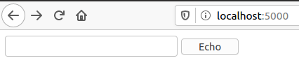

# Web application development with Dancer
{id: dancer}

## Install Perl on Windows
{id: install-perl-for-dancer}

* [Strawberry Perl](http://strawberryperl.com/)

## Install Perl on Linux and Mac OSX
{id: install-perl-for-dancer-linux}

* [perlbrew](https://perlbrew.pl/)

* [cpan.org](https://www.cpan.org/)
* [cpan minus](http://cpanmin.us/)  aka. cpanm
* [local::lib](https://metacpan.org/pod/local::lib)

After following the instruction in the video add the following to `~/.bash_profile` and open a new terminal:

```
export PATH=/opt/perl/bin:$PATH
eval $(perl -I ~/perl5/lib/perl5/ -Mlocal::lib)
```

## Install Editor
{id: install-editor-for-dancer}

* [VS Code](https://code.visualstudio.com/)
* [Notepad++](https://notepad-plus-plus.org/)

## Slides and Example
{id: source-of-slides-and-examples}

* [Source of slides and examples](https://github.com/szabgab/slides)

## Install Dancer2
{id: install-dancer}
{i: cpanm}
{i: Dancer2}

* Install [cpanm](https://metacpan.org/pod/App::cpanminus) if you don't have it yet:

```
curl -L https://cpanmin.us | perl - App::cpanminus
```

* Install Dancer2:

```
cpanm Dancer2
```

{aside}
Note, during the following pages I am going to use the word Dancer, however the name of the package we are using is Dancer2
and there is also a package called Dancer which was the first incarnation of this framework.
{/aside}

## Hello World with Dancer
{id: hello-world-with-dancer}
{i: get}
{i: plackup}
{i: to_app}
{i: psgi}

{aside}
Create an empty directory where you can put your files.

Create a file called `app.psgi` in that directory with the following content.

The `get` keyword creates a so-called route that maps a URL path onto an anonymous subroutine. In this
case we mapped the root page `/`.

Whatever the function returns will be returned to the browser. By default as HTML.

Then the `to_app` call basically provides a running application to `plack` which is a small web-server used for development purposes.
{/aside}


* Run the application by `cd`-ing into its directory and then typing: **plackup**
* Then you can see it at **http://localhost:5000**

{aside}
You might have noticed I did not add `use strict` and `use warnings` to this code.
That's because Dancer2 loads both of them by default.
{/aside}

## Testing Hello World of Dancer
{id: testing-hello-world-of-dancer}
{i: prove}
{i: Test::More}
{i: Plack::Test}
{i: HTTP::Request::Common}
{i: GET}
{i: done_testing}
{i: is}

{aside}
It is great that we can create a web page using Dancer, but if our application has any value to us
then we will want to make sure it works as expected and that it continues to work even after some changes were made.

The fastest and cheapest way to do this to write tests. Unit-, integration-, acceptance tests, name them as you like,
the important part is that they verify that the code works (and fails) as expected.

As this is such an integral part of writing code, we won't delay writing tests to the end of the project. We jump in right now.

Next to our `app.psgi` we create a file called `test.t` with the following content.
{/aside}


{aside}
We can then run it by typing in `prove -v test.t` on the command line. this is going to be the output:
{/aside}

```
prove -v test.t
```

* [Test::More](https://metacpan.org/pod/Test::More)
* [Plack::Test](https://metacpan.org/pod/Plack::Test)
* [Plack::Util](https://metacpan.org/pod/Plack::Util)
* [HTTP::Response](https://metacpan.org/pod/HTTP::Response)


## Showing the current time with Dancer
{id: showing-the-current-time-with-dancer}

{aside}
In the first example we saw how to show a simple page that does not change between executions.

We now go a small step further and show a page that will show a different output every time we access it.

Still nothing fancy, just showing the current date and time.

We could of course use the built-in `time` function or the also built-in `localtime` function, but I wanted to
show something a bit nicer. So we are using the DateTime module to generate an object representing the current timestamp
and then we use the `strftime` method to create a nice-looking timestamp.

Dancer-wise we don't do much, we just return the resulting string.
{/aside}


* Run `plackup`
* Access at http://127.0.0.1:5000/
* Output: 2020-07-22 11:11:55

## Testing the current time with Dancer
{id: testing-the-current-time-with-dancer}
{i: like}
{i: qr}

{aside}
Just like in the first case, we would like to make sure our code works now and that it keeps working after we make
changes. So we are going to write a test for this application as well.

However unlike in the previous case, here we cannot compare the results to a fixed value as the result will be
different every time we run the test.

We could mock the time generating code of the Dancer application, but for this application it would be an overkill.

So instead of that we weaken our test and compare the results to a regular expression. So we don't know that the returned
string is indeed the correct date and time, but at least we can know that it looks like one.

The `like` keyword of Test::More provides this testing functionality.
{/aside}


* Run as `prove test.t`

## 404 Not Found in Dancer
{id: dancer-404-not-found-error}

{aside}
If a user tries to access a path that has no matching route defined then Dancer will return a default "404 Not Found" error page
with the appropriate HTTP status code.

Later we'll see how can we change the content of this page to be branded to our site.
{/aside}


## 500 Internal Server Error in Dancer
{id: dancer-500-internal-server-error}

{aside}
Mistakes can happen. There might be an exception somewhere in one of the routes. Don't worry though. If that happens Dancer will show a standard "500 Internal Error" page.

In our sample application the "/calc" route tries to make some calculation but a division by 0 error occures. This will trigger the "500 Internal Error".

Usually you don't plan to have certain URLs and certain input generate such error, so you probably will never write a test for this, but now, that we are showing it
I put together one.

Later we'll see how can we change the content of this page to be branded to our site.
{/aside}


## Process GET (query request) parameters in Dancer
{id: process-get-parameters-in-dancer}
{i: query_parameters}
{i: GET}
{i: form}
{i: input}
{i: submit}

{aside}
Once we know how to generate responses on-the-fly, probably the next things we would like to know is how to handle user-input.
There are several ways to get input from a user of a web application. One of them is called query parameters that are sent
in via GET requests. You are probably familiar with them as they appear in the URL of a page after a question mark. Like this:

**echo?message=Foo+Bar**

Anyone could type in such a URL, but usually you have a HTML form on your page and when the user clicks on the submit button
then the browser sends in the data from the INPUT fields.

In our example the main route sends back a form with two INPUT elements. One of them is a text field the other one is the submit button.
In the FORM tag you can see the path to which the data of the form will be submitted along with the name of the method: GET. (The latter is
optional as GET is the default method.)

When the user visits the page, she will see an empty text box with a button that says "Echo". She can then type in some text
(e.g. **Foo Bar**), click on the button and the browser will submit the content by accessing the URL **echo?message=Foo+Bar**.

In the Dancer application this will trigger the '/echo' route where using the get method of the query_parameters object
we can receive the text sent in by the user. Then it is only a simple matter of sending it back to show what the user has typed in.

We are embedding the HTML in this code so it will be a one-file solution. In a bigger application we would use the template system and put the HTML in an external file.
{/aside}




* Run as `plackup app.psgi` and then access at http://localhost:5000/


## Testing GET request with query parameters in Dancer
{id: testing-get-requests-with-query-parameters-in-dancer}
{i: GET}
{i: like}

{aside}
Before we go on to the next feature let's make our usual step and write a test for the route handling the query parameters.

The main page now returns a chunk of HTML code. We could repeat the same HTML in our tests, but that would not give as any real value.
We would be better off trying to look for some key elements in the page. In a real-world application that might be verifying if a certain
HTML element is in the response or not. We won't be able to check equality here, so in this example I used the `like` function of Test::More
to compare the content of the page to a regular expression.

The really interesting test is the "echo" subtest where we submit a request with a query string and then check if the result is as we expected.
(The + sign represents a space.)
{/aside}


* Run as `prove test.t`

## Process POST requests in Dancer
{id: process-post-requests-in-dancer}
{i: body_parameters}
{i: POST}

{aside}
In addition to the GET request the other common verb used in HTTP is POST. When you are implementing a REST API these verbs have real meaning,
but when you are writing a user-facing web application the choice between GET and POST usually boils down to the question if you'd like
the people to see the parameters passing in the URL or not.

With GET you'd have the visible query string, with POST the browser will send the same data in the body of the HTTP request invisible to
the regular user. The data is still sent and if the server does not use https, the data is still readable by anyone listening on the wire.

You probably use GET if you'd like to allow your users to send the specific URL with the data to someone else or if you'd like to let them
bookmark the page with the data. You'd use POST if you prefer they don't send the data to their friends as well.

In the code we had to make the following changes:

On the main page the form now sets the method to be POST.

The /echo route is now declared with the `post` keyword telling Dancer to execute this function when a POST request arrives at that route.

The data is extracted from the request in the `body_parameters` hash.
{/aside}


* Run as `plackup app.psgi` and then access at http://localhost:5000/

## Test POST requests in Dancer
{id: test-post-requests-in-dancer}

{aside}
Testing a POST request is as simple as testing a GET request.

In the test if the index page we need to expect the method="POST".

In the echo subtest we use the POST keyword to tell the client to send in a POST-request and we pass in the content of
the body as an anonymous hash.
{/aside}


* Run as `prove test.t`

## Exercise: Dancer Calculator
{id: exercise-dancer-calculator}

* Create a web application that has a form with 3 fields. Two text fields to accept two numbers and a drop-down list where the user can select one of the 4 basic math operations.
* When the user submits the for the server will calculate and display the results of the calculation.
* Also write tests that will verify the proper beahvior of the application

* You can create a solution using GET and a solution using POST. Just for fun.

## Exercise: Dancer Counter
{id: exercise-dancer-counter}

* Create an application that will show you a growing number on every visit.
* Can you make it so that the counter will continue even after we restarted the server?
* Write tests for the application.

## Solution: Dancer Calculator - try 1
{id: solution-dancer-calculator-1}


## Solution: Dancer Calculator - try 2
{id: solution-dancer-calculator-2}


## Solution: Dancer Calculator
{id: solution-dancer-calculator}


* [HTTP status](https://metacpan.org/pod/Dancer2::Core::HTTP)
* [HTTP status codes](https://developer.mozilla.org/en-US/docs/Web/HTTP/Status)

## Solution: Dancer Counter - try 1
{id: solution-dancer-counter-1}


## Solution: Dancer Counter - try 2
{id: solution-dancer-counter-2}


## Solution: Dancer Counter
{id: solution-dancer-counter}


## Dancer: show errors during development
{id: dancer-show-errors}


## Dancer: Logging
{id: dancer-logging}


* [Dancer2::Core::Role::Logger](https://metacpan.org/pod/Dancer2::Core::Role::Logger)

## Dancer: Receive parameter in route
{id: receive-parameter-in-route-dancer}
{i: param}
{i: subtest}

{aside}
Each URL path can be mapped to a specific function, but we can also map a whole set of URLs to a single function and use
parts of the URL path as parameters. For example we might want to show information about each user via their profile URL
which is **/user/ID** where the ID is their user id.
(For public URL it is probably a better idea to let them have a unique username and use that, but the basic concept is the same.)

We can set it up in the following way:
{/aside}


## Dancer: Test parameter in route
{id: test-parameter-in-route-dancer}

{aside}
If you have seen the previous examples then this test script won't surprise you.

The first subtest, called 'main', checks the main page of our web application. Because this is such a small example we check equality here using the **is** function.

The second subtest, called 'one', checks a value that can be a valid user-id.

The third subtest, called 'anything', checks some arbitrary string as a user-id. As you can see, in our current version this call is also expected to work and return the word "anything".
That's right for this test as our current version of the application does not do any input validation.
{/aside}


## Dancer: Type-checking for the route parameters
{id: type-checking-for-the-route-parameters}
{i: Int}

{aside}
Dancer allows us to use type-constraints to limit what values we accept in a route. For example we can tell it that the value must be an integer.

If the request does not match the expected type then that route does not match. If none of the routes match then we get a "404 Not Found" error as expected.
{/aside}

* [Route-Handlers](https://metacpan.org/pod/distribution/Dancer2/lib/Dancer2/Manual.pod#Route-Handlers)
* [Types](https://metacpan.org/pod/distribution/Type-Tiny/lib/Type/Tiny/Manual/AllTypes.pod)


## Dancer: Test Type-checking for the route parameters
{id: test-type-checking-for-the-route-parameters}


## Dancer: Send 404 Not Found manually
{id: send-404-not-found-manually-dancer}
{i: status}
{i: not_found}
{i: 404}

{aside}
If a user arrives to a URL path that is not associated with anything then Dancer will automatically return a 404 Not Found page.
What if we have a catch-all route as in the previous example, where one part of the URL path is the ID of a user.
What if then someone tries to access a page that does not belong to any user? Ideally the application would return a 404 Not Found page
this time as well, but Dancer cannot automatically understand which ID is valid and when to send a 404 Not found page.

We have to send it manually. For this, before sending back the page we first call `status 'not_found';` to tell Dancer to set the
HTTP return status to 404. Then we can send back any HTML (or plain text). It will be displayed but the browser, or whatever client
the user uses will be also told the status code is 404.
{/aside}


## Dancer: Test sending 404 Not Found manually
{id: test-send-404-not-found-manually-dancer}


## Dancer: Optional route parameter
{id: optional-route-parameter}


## Dancer: Regex route parameter
{id: regex-route-parameter}


## Dancer: Wildcard route parameter
{id: wildcard-route-parameter}


## Redirect
{id: redirect}

* [Redirection](https://developer.mozilla.org/en-US/docs/Web/HTTP/Redirections)


## Exercise: Route-based multi-counter
{id: exercise-route-based-multi-counter}

Create an application that will count from 1 up for every url like this: `/apple` and will
show the list of counters when the `/` page is accessed.

## Exercise: Random Redirect
{id: exercise-random-redirect}

* Create an application that has a list of URLs (they can be stored inside the program) and has a path that will randomly select one of the URLs and redirect the visitor to it.
* Write a test as well


## Solution: Route-based multi-counter
{id: solution-route-based-multi-counter}


## Solution: Testing Route-based multi-counter
{id: solution-testing-route-based-multi-counter}


## Solution: Random Redirect
{id: solution-random-redirect}


## Solution: Testing Random Redirect
{id: solution-testing-random-redirect}


## Show configuration
{id: show-configuration}


## Session
{id: session}


