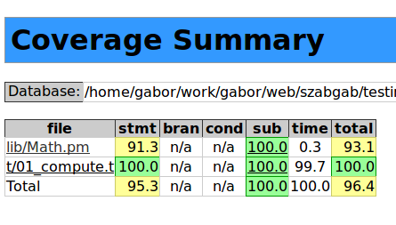

# Test::More
{id: test-more}

## Moving over to Test::More
{id: moving-to-test-more}
{i: Test::More}

Test::Simple is really a very simple module. Its sole exported function is the "ok" function.

Test::More has the same "ok" function - so it is a drop-in replacement - but it also has lots of
other functions and tools:

* `ok`
* `is`
* `isnt`
* `diag`
* `like`
* `cmp_ok`
* `is_deeply`
* `SKIP`
* `TODO`
* `done_testing`
* `subtest`


```
Better error reporting.
```


In the end every test can be based on the single ok() function.
The additional functions mainly serve as convenience methods
to allow better error reporting.


## Test::More ok(  trueness,     name);
{id: test-more-ok}
{i: ok|Test::More}


A drop-in replacement of Test::Simple.


```
perl t/31.t
```


## Test::More is(  value,   expected_value,   name);
{id: test-more-is}
{i: is}


It would be much better to see the expected value and the actually received value.
This usually helps in locating the problem.


```
perl t/32.t
```


See, in this case we can already guess that it cannot add 3 values.

* `is` compares using `eq`

## Test::More isnt( value, not_expected_value,  name);
{id: test-more-isnt}
{i: isnt}

Sometimes you are expecting to get a value but you don't really know what.
You just know one specific value that you want to make sure you have not
received.


```
perl t/isnt.t
```


This isn't a good example though.


## Test::More isnt undef
{id: test-more-isnt-undef}
{i: undef}


```
perl t/isnt_undef.t
```

Output:


## note( message ) or diag( message );
{id: test-more-diag-note}
{i: diag}
{i: note}

* `diag` prints out a message along with the rest of the output.
* `note()` does the same, but when running under the prove it does not show up.

Use it for whatever extra output in order to ensure that
your printouts will not interfere with future changes in the
test environment modules (such as `prove` or `Test::Harness`).


```
$ perl t/messages.t
```


```
prove t/messages.t
```


```
prove -v t/messages.t
```


## (note or diag) explain( a_variable );
{id: test-more-explain}
{i: explain}

* `explain();` will recognize if its parameter is a simple scalar or a reference to a more complex data structure.

Its result must be passed to either note(); does or diag();


```
perl t/explain.t
```


## TODO
{id: test-more-todo}
{i: TODO}

When you don't want to see the failing tests any more


**$ perl t/34.t**


```
1..3
# Add two numbers
ok 1 - 1+1
ok 2 - 2+2
# Add 3 numbers
not ok 3 - 2+2+2 # TODO fix bug summing more than 2 values #173
#   Failed (TODO) test '2+2+2'
#   at t/34.t line 16.
#          got: '4'
#     expected: '6'
```

{aside}

In the eXtreme Programming paradigm the following two key aspects are somewhat
in contradiction:
1) Write your test before you write your code.
2) Make sure your test suit always passes at 100%.

Of course after you already wrote your tests for a new feature but before you
can write the actual code there is a short time period when your test suit will
not pass 100%.

Worse than that, it is also recommended that immediately when you get a bug report
from somewhere you should write a test case that reproduces this bug. Obviously
this test will fail before you fix the bug and will hopefully pass once you fixed it.

In order to make the test suit happy there is a way to tell the harness tool that a test
is *supposed to fail*. That is, we know it will fail. What we can do to achieve this is
to set one or more tests to be in a TODO block.
{/aside}

TODO with prove


**$ prove t/34.t**


```
t/34......# Add two numbers
# Add 3 numbers
ok
All tests successful.
Files=1, Tests=3,  0 wallclock secs
  ( 0.00 usr  0.00 sys +  0.02 cusr  0.00 csys =  0.02 CPU)
Result: PASS
```


## TODO: unexpected success
{id: test-more-todo-unexpected-success}

What if the bug gets fixed - accidentally?


```
1..3
# Add two numbers
ok 1 - 1+1
ok 2 - 2+2
# Add 3 numbers
ok 3 - 2+2+2 # TODO fix bug summing more than 2 values #173
```

```
t/35......# Add two numbers
# Add 3 numbers
ok
All tests successful.

Test Summary Report
-------------------
t/35.t (Wstat: 0 Tests: 3 Failed: 0)
  TODO passed:   3
Files=1, Tests=3,  0 wallclock secs
  ( 0.01 usr  0.00 sys +  0.02 cusr  0.00 csys =  0.03 CPU)
Result: PASS
```


## like(value, qr/expected regex/, name);
{id: test-more-like-date}

**last_update()**


```
This page was last updated at 2014-09-23T04:43:44
```


**perl t/last_update.t**


## like(value, qr/expected regex/, name);
{id: test-more-like}
{i: like}

**get_copyright()**


```
Copyright 2000-2008 Gabor Szabo, all rights reserved.
```


What if you don't want or can't realisticly expect an exact match with the result?


You can use `like` that compares with =~


**perl t/copyright.t**


```
1..2
ok 1 - copyright
not ok 2 - copyright
#   Failed test 'copyright'
#   at t/copyright.t line 11.
#               'Copyright 2000-19108 Gabor Szabo, all rights reserved.'
#     doesn't match
#       '(?-xism:Copyright 2000-\d{4} Gabor Szabo, all rights reserved.)'
# Looks like you failed 1 test of 2.
```


## Another example
{id: test-more-like2}


**perl intro-testing/like.t**


```
1..2
ok 1 - there are some digits in the result
not ok 2 - there are some digits in the result

#   Failed test 'there are some digits in the result'
#   at examples/intro/like.t line 8.
#                   'This is another string with no number in it'
#     doesn't match '(?-xism:\d+)'
# Looks like you failed 1 test of 2.
```


## cmp_ok(   this,   op,  that,    name);
{id: test-more-cmp-ok}
{i: cmp_ok}

{aside}

Sometimes an eq by is() or a regular expression by like() just isn't good enough.
For example what if you would like to check the rand() function of perl? Its result 
must be between 0 (inclusive) and 1 (non inclusive).
{/aside}

{aside}

In other case you might have a function that should happen within a certain period of time.
You don't have an exact expectation but you know the elapsed time must be between a lower
and upper limit.
{/aside}


`cmp_ok` compares with any operator you like.


**perl examples/intro-testing/cmp_ok.t**


```
1..2
ok 1 - process was waiting at least 2 secs
ok 2 - process was waiting at most 3 secs
```

**perl examples/intro-testing/cmp_ok.t**


```
1..2
not ok 1 - process was waiting at least 2 secs
#   Failed test 'process was waiting at least 2 secs'
#   at examples/intro/cmp_ok.t line 11.
#     '0'
#         >=
#     '2'
ok 2 - process was waiting at most 3 secs
# Looks like you failed 1 test of 2.
```


## is_deeply(  complex_structure,   expected_complex structure,   name);
{id: test-more-is-deeply}
{i: is_deeply}


Compare two Perl data structures:


```
1..10
ok 1 - fib 1
ok 2 - fib 2
ok 3 - fib 3
ok 4 - fib 4
not ok 5 - fib 5
#   Failed test 'fib 5'
#   at t/is_deeply.t line 16.
#          got: '7'
#     expected: '5'
ok 6 - fibs 1
ok 7 - fibs 2
ok 8 - fibs 3
ok 9 - fibs 4
not ok 10 - fibs 5
#   Failed test 'fibs 5'
#   at t/is_deeply.t line 22.
#     Structures begin differing at:
#          $got->[2] = '4'
#     $expected->[2] = '2'
# Looks like you failed 2 tests of 10.
```


## is_deeply on a hash
{id: test-more-is-deeply-hash}


Another example with `is_deeply`
checking the returned hash from a bug tracking system.


```
1..3
ok 1 - Query 0
not ok 2 - Query 1
#   Failed test 'Query 1'
#   at t/is_deeply_bugs.t line 21.
#     Structures begin differing at:
#          $got->{errors} = '9'
#     $expected->{errors} = '6'
not ok 3 - Query 2
#   Failed test 'Query 2'
#   at t/is_deeply_bugs.t line 24.
#     Structures begin differing at:
#          $got->{errors} = Does not exist
#     $expected->{errors} = '6'
# Looks like you failed 2 tests of 3.
```

{aside}

What if we are testing a live system and so not interested in the exact values,
just in the keys and the fact that the values are numbers?
{/aside}

{aside}

Look at the code that generates the bug reports you'll see that testing the 4th return value
- which is quite complex already - is hard. We cannot test against a fixed hash as some
of the values are totally dynamic (e.g. a timestamp).
{/aside}


## Platform dependent tests
{id: platform-dependent-tests}


**perl examples/intro-testing/without_skip.t**


```
ok 1
Can't exec "ipconfig": No such file or directory at without_skip.t line 8.
not ok 2
#   Failed test at examples/intro/without_skip.t line 8.
#                   undef
#     doesn't match '(?-xism:Windows IP Configuration)'
1..2
# Looks like you failed 1 test of 2.
```

{aside}

Sometimes, you know that a part of your test suite isn't relevant.
Running them - if at all possible - would report false results.
Maybe some of the features of your system are platform dependent, you don't want to
test them on an unsupported platform. Sometimes failure of previous tests make a
test irrelevant.

In all such cases what you actually want is to skip the tests. Surprisingly the way
to do that is to enclose the tests in a SKIP block.
{/aside}


## SKIP some tests
{id: test-more-skip}
{i: SKIP}


Output:


```
1..2
ok 1
ok 2 # skip Windows related tests
```


## SKIP with locale
{id: test-more-skip-with-locale}


## Stop running current test script
{id: test-more-stop-testing}

{aside}

When running a test script sometimes we reach a 
failure that is so problematic you cannot go on testing. 
This can be in the scope of a single test script in which case
you would call exit() to abort the current test script or it can
be so bad that all the testing should stop. In that case you should call
BAIL_OUT(). That will indicate the harness that it should not call
any other test script.
{/aside}


**perl examples/test-perl/t/exit.t**


```
1..3
ok 1 - first
not ok 2 - second
#   Failed test 'second'
#   at examples/test-perl/t/exit.t line 7.
# Looks like you planned 3 tests but ran 2.
# Looks like you failed 1 test of 2 run.
```

**prove examples/test-perl/t/exit.t**


```
perl/t/exit.t .. 1/3 
#   Failed test 'second'
#   at perl/t/exit.t line 7.
# Looks like you planned 3 tests but ran 2.
# Looks like you failed 1 test of 2 run.
perl/t/exit.t .. Dubious, test returned 1 (wstat 256, 0x100)
Failed 2/3 subtests 

Test Summary Report
-------------------
perl/t/exit.t (Wstat: 256 Tests: 2 Failed: 1)
  Failed test:  2
  Non-zero exit status: 1
  Parse errors: Bad plan.  You planned 3 tests but ran 2.
Files=1, Tests=2,  0 wallclock secs
    ( 0.03 usr  0.01 sys +  0.02 cusr  0.00 csys =  0.06 CPU)
Result: FAIL
Failed 1/1 test programs. 1/2 subtests failed.
```


## Stop all the test scripts
{id: test-more-bail-out}
{i: BAIL_OUT}


**perl examples/test-perl/t/bail_out.t**


```
1..3
ok 1 - first I
not ok 2 - second II
#   Failed test 'second II'
#   at examples/test-perl/t/bail_out.t line 8.
Bail out!  no way
```

**prove examples/test-perl/t/bail_out.t**


```
perl/t/bail_out.t .. 1/3 Bailout called.  Further testing stopped:  no way

#   Failed test 'second II'
#   at perl/t/bail_out.t line 8.
FAILED--Further testing stopped: no way
```


## Stop testing - with prove
{id: test-more-stop-testing-with-harness}


See earlier.


## Exercises
{id: exercise-test-more}

* Take the ifconfig/ipconfig test script (examples/intro-testing/skip_with_locale.t) and fix it so that there will be a skip block on the ifconfig part as well.
* Take a local copy of the Math::RPN module located in (examples/Math-RPN) and add 30 test cases.
* You can also look for a module on CPAN - maybe one that you are using a lot.  Maybe one that you found a problem with.
* Download the tar.gz file from CPAN unzip it (don't install the module) and write at least 20 tests.


## Test coverage using Devel::Cover
{id: devel-cover}
{i: Devel::Cover}

**cover --test**


{aside}

Once we know that our tests are passing we could check which lines 
are exercised in the code during the test execution. For this
we can use Devel::Cover by Paul Johnson.
First we need to run the tests again now instrumenting with Devel::Cover.
This will be much slower than the regular execution but in the end
we will get a text report and we will be able to build a nice HTML
report with drill down about all the code we ran.
{/aside}


```
All tests successful.
Files=11, Tests=2078, 50 wallclock secs
```


[CPAN Cover](http://cpancover.com/)


## Can module be loaded? use_ok and require_ok
{id: test-use-ok}
{i: use_ok}
{i: require_ok}

{aside}

use_ok and require_ok are not recommended any more. Just **use** or **require** the modules as necessary
and let perl provide the appropriate failure message if either of those fails.
{/aside}


```
1..1
ok 1 - use MyTools;
```


## can_ok('Class', qw(method_a method_b));
{id: test-more-can-ok}
{i: can_ok}

can_ok($object, qw(method_a method_b));


{aside}

In order to nicely test if a module has certain methods you can use the can_ok() function of Test::More.
It can be used both on modules and on objects.
{/aside}


Output:


```
1..2
ok 1 - MyTools->can('fibonacci')
not ok 2 - MyTools->can('make_tea')
#   Failed test 'MyTools->can('make_tea')'
#   at examples/test-perl/t/can_ok.t line 11.
#     MyTools->can('make_tea') failed
# Looks like you failed 1 test of 2.
```


## Declare your plan at execution time
{id: test-calculated-plan}
{i: plan}

```
use Test::More tests => 6;

or

use Test::More;
...
plan tests =>  6;
```

{aside}

No need to tell your plan at load time;
{/aside}

{aside}

Earlier when we were talking about Test::Simple we had a case when
the test data was placed in an array and the test script looped over
the array executing the function to be tested for each input.
{/aside}

{aside}

Later we moved the data to an external file which made it even more
difficult to declare the plan so we used lengthy code in the BEGIN block
in order to have the expected number of tests before Test::Simple is loaded
into memory.
{/aside}

{aside}

With Test::More we have a much better solution. We don't have to
declare the plan on the use Test::More line. We can do that later,
in the run time of the Perl script.
{/aside}


## Test blocks (use subtest instead)
{id: test-blocks}
{i: {}}

{aside}

Create small blocks of tests
{/aside}

{aside}

When writing a test script you often write similar pieces of code that do
unrelated tests. You can reuse the same variables throughout the test script
but that means that in case of a bug in the test script the various parts might
have effects on each other.

You can also invent new names for the variables but there are only so many names
you can reasonably use for the same kind of data.

The best solution probably is to put the individual pieces into anonymous blocks.
That serves several purposes. First of all it makes clear to both the writer of the
code and the reader that the blocks are mostly independent.
It also ensures that the variables used in one block won't interfere with the variables
in the other block. You'll even have to define these variables in both blocks.
{/aside}


## Counting tests in the small blocks (use subtest instead)
{id: test-begin-block}
{i: BEGIN}

{aside}

When you are writing many test in one file quickly you'll face the problem of
keeping the "plan" up to date. You will add a test and forget to update
the number worse, you'll add many tests and when you suddenly remember you
did not update the number it is too late already. Will you switch to "no_plan"?
Will you count the ok(), is() and similar calls? Will you run the test and update your expectation accordingly?

There is trick I learned on the perl-qa mailing list.

You declare a variable called $tests at the beginning of the script.
Then at the end of each section you update the number.
{/aside}


See also:
[Test::Block](http://metacpan.org/pod/Test::Block)


## subtest with plan
{id: subtest-with-plan}


**perl t/planned_subtest.t**


```
1..3
ok 1 - 1+1
    # Subtest: negatives
    1..2
    ok 1 - -1, -1
    not ok 2 - -1, -1, -1
    #   Failed test '-1, -1, -1'
    #   at t/planned_subtest.t line 14.
    #          got: '-2'
    #     expected: '-3'
    # Looks like you failed 1 test of 2.
not ok 2 - negatives
#   Failed test 'negatives'
#   at t/planned_subtest.t line 15.
ok 3 - 2+2
# Looks like you failed 1 test of 3.
```


**prove t/planned_subtest.t**


```
t/planned_subtest.t .. 1/3     
    #   Failed test '-1, -1, -1'
    #   at t/planned_subtest.t line 14.
    #          got: '-2'
    #     expected: '-3'
    # Looks like you failed 1 test of 2.

#   Failed test 'negatives'
#   at t/planned_subtest.t line 15.
# Looks like you failed 1 test of 3.
t/planned_subtest.t .. Dubious, test returned 1 (wstat 256, 0x100)
Failed 1/3 subtests 

Test Summary Report
-------------------
t/planned_subtest.t (Wstat: 256 Tests: 3 Failed: 1)
  Failed test:  2
  Non-zero exit status: 1
Files=1, Tests=3,  0 wallclock secs
  ( 0.03 usr  0.00 sys +  0.02 cusr  0.00 csys =  0.05 CPU)
Result: FAIL
```


## done_testing
{id: done-testing}
{i: done_testing}

{aside}

I am not a fan of it, but in rare cases it is useful to know that **done_testing** can be used to signal all tests have been done.
This way we don't need to have a "plan".
{/aside}


## subtest with implicit done_testing
{id: subtest}
{i: done_testing}


Implicit call to done_testing inside. skip-able, etc.


## skip all
{id: skip-all}
{i: skip_all}


## All the tests
{id: tests-all-test}

```
Just to show you all the tests of the MyTools module we used
```


## Exercise: skip test
{id: exercise-skip-test}

* Write a test that will be skipped if is run as root. (Administrator on Windows?)
* And another test that will executed only when not run as root.
* Write a test script called long.t that takes a long time to run. Execute it only if the RUN_LONG environment variable is true.
* Other ideas: Skip tests that need database access and/or tests that need network access.


## Exercise: use coverage
{id: exercise-test-coverage}

Generate a test coverage report for Math::RPN or the module you
are testing and look for holes in the coverage. Add more tests.
A few suggestions:
Archive::Zip, 
[top 20](http://blogs.perl.org/users/neilb/2014/08/fix-a-bug-on-cpan-day.html).

