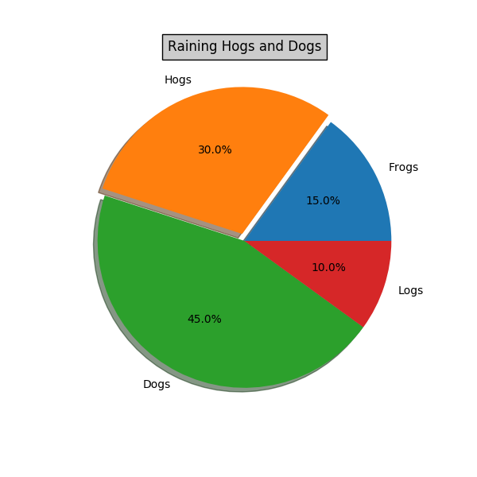

# Matplotlib
{id: matplotlib}

## Matplotlib Line
{id: matplotlib-about}

* [matplotlib](http://matplotlib.org/)

## Matplotlib Line
{id: matplotlib-line}

## Matplotlib Pie
{id: matplotlib-pie}

## Plot, scatter, histogram
{id: matplotlib-plot}

* plot - line
* scatter - just the values
* histogram (to group the values into bins)
* plt.hist(data, bin=10)

