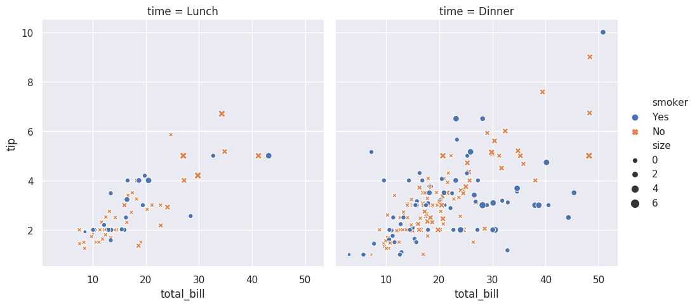

# Seaborn
{id: seaborn}

## Searborn use examples
{id: searborn-use-examples}

[seaborn](https://seaborn.pydata.org/)

In Jupyter notebook type `%matplotlib` before writing the seaborn code.

In plain Python `import matplotlib`, then assign the result of the ploting function
to a variable, and call `matplotlib.pyplot.show(r)`.

## Seaborn tip
{id: seaborn-tip}

## Seaborn Anscombes Quartet
{id: seaborn-anscombes-quartet}

