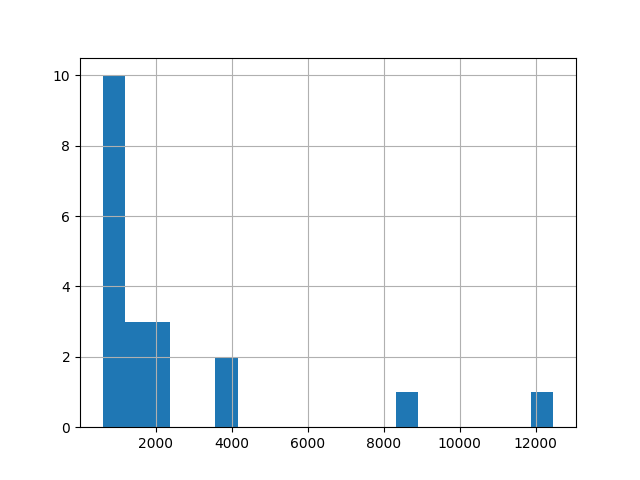

# Pandas
{id: pandas}

## Pandas
{id: about-pandas}

* [Pandas](https://pandas.pydata.org/) Python Data Analysis Library
* Handle data sequences
* [A Beginner's Guide to Optimizing Pandas Code for Speed](https://engineering.upside.com/a-beginners-guide-to-optimizing-pandas-code-for-speed-c09ef2c6a4d6)

## Datasets
{id: datasets}

* Planets
* StackOverflow survey

## Planets data
{id: planets-data}


## StackOverflow Survey data
{id: stackoverflow-survey-data}

* Download one of the datasets from the [Stack Overflow survey](https://insights.stackoverflow.com/survey)
* unzip the file. Feel free to remove the `__MACOSX/` directory if it is still there.

## Planets - Read CSV into Dataframes
{id: pandas-planets-read-csv}
{i: read_csv}


## Planets - DataFrame Statistics
{id: pandas-planets-statistics}
{i: columns}
{i: dtypes}
{i: index}
{i: values}
{i: describe}


## Pandas Read CSV various datatypes
{id: pandas-read-csv-various-datatypes}

{aside}
Example with a few more column-types (e.g. the column with the title MyBool contains True and False values and it is recognized as bool)
{/aside}


## Pandas Read CSV set dtype
{id: pandas-read-csv-set-dtype}

{aside}
When recognizing integers read_csv will default to int64, but if we would like to save memory we can set the dtype while we read the file.
{/aside}


## Pandas Read CSV convert values
{id: pandas-read-csv-convert-values}

{aside}
Sometime the data in the CSV file represents something else or we might want to change the meaning of the data.

For example in some  cases 0 represents False and 1 represents True. If the CSV file contains 0 and 1 values in a column Pandas will automatically represent them as integers.
We can convert them to False and True values respectively.

In another case we might have exit-codes in a column where 0 means success and any other number means failure. We might want to simplify that column and represent success by True
and failure by False. (Yes, we loose the details of the failure, but maybe we are not interested in the details.)

This latter is what we can see in our example.
{/aside}


## Pandas split multivalue column into separate columns
{id: pandas-split-multivalue-column}


## Pandas split multivalue column into separate columns - get_dummies
{id: pandas-split-multivalue-column}
{i: get_dummies}


## Planets - Show first and last rows
{id: pandas-planets-show-first-and-last-rows}
{i: head}
{i: tail}

* `head` will show the first few rows (defaults to 5)
* `tail` will show the last few rows (defaults to 5)


## Planets DataFrame select columns
{id: pandas-planets-select-columns}


## Planets DataFrame select rows
{id: pandas-planets-select-rows}


## Planets DataFrame select rows and columns
{id: pandas-planets-select-rows-and-columns}


## DataFrame filter rows by size
{id: pandas-planets-filter-rows-by-size}


## DataFrame filter rows by value
{id: pandas-planets-filter-rows-by-value}


## DataFrame filter rows by value in list
{id: pandas-planets-filter-rows-by-value-in-list}


## DataFrame filter elementwise boolean and
{id: pandas-planets-filter-elementwise-boolean-and}


## DataFrame sort (sort_values)
{id: pandas-planets-sort}
{i: sort_values}


## DataFrame loc vs. iloc
{id: pandas-planets-loc-vs-iloc}

* `loc` by values (here we start from the row where the index column == 3
* `iloc` by index (here we start from the 3rd row)


## Pandas Planets - Add calculated column, remove / delete column (drop)
{id: pandas-add-column}


## Pandas Planets - calculate
{id: pandas-plantes-calculate}


## Pandas read CSV set index column
{id: pandas-read-csv-set-index-column}


## Count values
{id: count-values}


## Select top items
{id: select-top-items}

* StackOverflow - biggest countries (in terms of number of responses)


## Pandas Show histogram
{id: pandas-show-histogram}




## Pandas read selected columns
{id: pandas-read-selected-columns}


## Pandas read file in chunks
{id: pandas-read-file-in-chunks}


## Pandas read selected rows in chunks
{id: pandas-read-in-chunks-select-rows}


## Combine columns to create a new column
{id: pandas-combine-columns}
{i: apply}


## Pandas read Excel
{id: pandas-read-excel}
{i: read_excel}


## Create Excel file for experiment with random data
{id: create-excel-file-for-experiment}

Input is an Excel file with the following columns:

```
genome name, c1, c2, c3, c4, c5, c6
```

* c1-c3 are numbers of cond1
* c4-c6 are numbers of cond2


We would like to filter to the lines that fulfill the following equations:

```
log2(avg(1-3) / avg(4-6)) > limit
other_limit > p.value( )
```


## Calculate Genome metrics
{id: calculate-genome-metrics}


## Exercise: Pandas
{id: exercise-pandas}

* Take the Stack Overflow survey and the report created by SO.
* Distribution of responses among countries.
* Relation of Open Source contribution to experience.
* Open Source contribution by country.
* Look at the pdf file and create similar reports for a specific country

* Pick a dataset from [Kaggle](https://www.kaggle.com/datasets) and try to analyze that.


