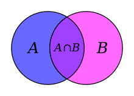
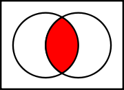
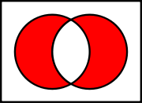
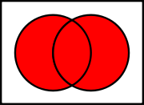

# Sets
{id: sets}

## sets
{id: python-sets}
{i: set}

* Sets in Python are used when we are primarily interested in operations that we know from the [set theory](https://en.wikipedia.org/wiki/Set_theory).
* See also the [Venn diagrams](https://en.wikipedia.org/wiki/Venn_diagram).
* In day to day speach we often use the word "group" instead of "set" even though they are not the same.
* What are the common elements of two set (two groups).
* Is one group (set) the subset of the other?
* What are all the elements that exist in both groups (sets)?
* What are the elements that exist in exactly one of the groups (sets)?

## set operations
{id: set-operations}
{i: set}
{i: issubset}
{i: intersection}
{i: symmetric_difference}

* set
* issubset
* intersection
* symmetric difference
* union
* relative complement (difference)

* [stdtypes: set](http://docs.python.org/library/stdtypes.html#set)

## Creating a set
{id: creating-a-set}

## Creating a set from a list
{id: creating-a-set-from-a-list}

## Converting set to list
{id: converting-set-to-list}

## Creating an empty set
{id: creating-an-empty-set}

## Adding an element to a set (add)
{id: adding-an-element-to-a-set}

## Merging one set into another set (update)
{id: merging-one-set-into-another-set}

## set intersection
{id: set-intersection}
{i: set}
{i: intersection}

* `intersection` returns the elements that are in both sets.

## set subset
{id: set-subset}
{i: set}
{i: issubset}

## set symmetric difference
{id: set-symmetric-difference}
{i: set}
{i: symmetric_difference}

* Symmetric difference contains all the elements in either one of the sets, but not in both. "the ears of the elephant".

## set union
{id: set-union}
{i: set}
{i: union}

## set relative complement (difference)
{id: set-relative-complement}

## Set of numbers
{id: set-of-numbers}

## Set of lists
{id: set-of-lists}

## Set of tuples
{id: set-of-tuples}

## Create set from List
{id: create-set-from-list}

