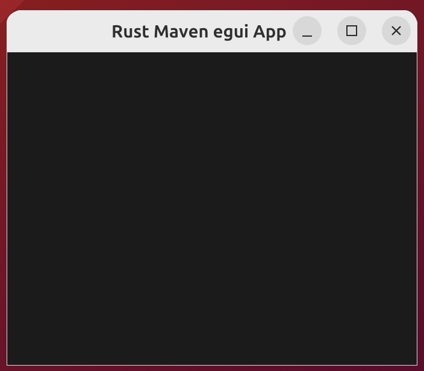
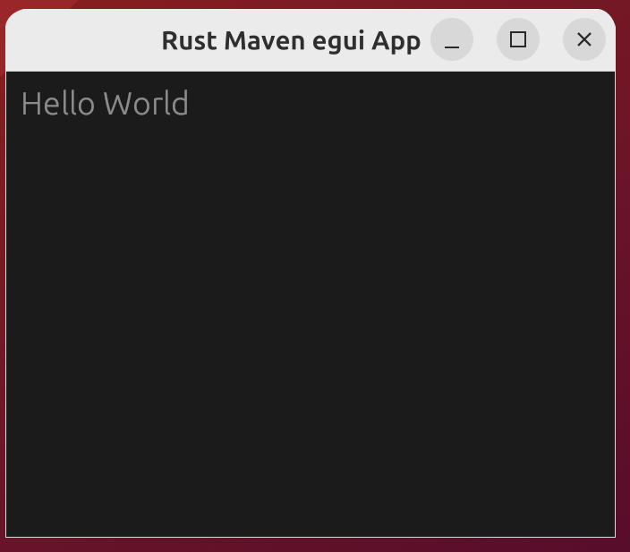
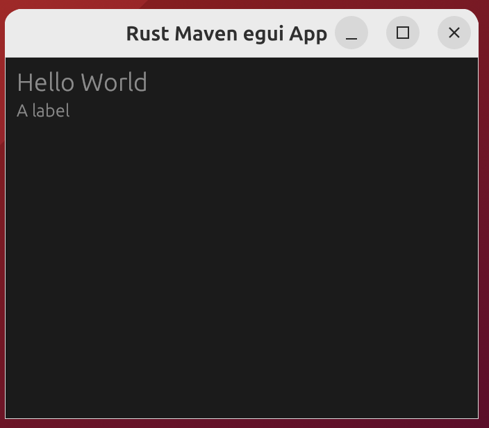
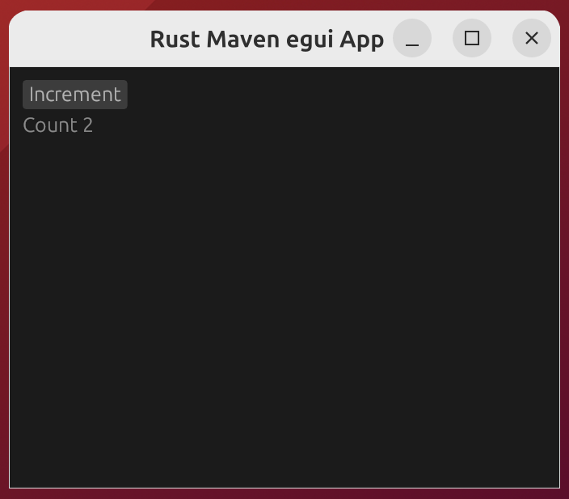

# egui
{id: egui}

## About eframe and egui
{id: about-eframe-and-egui}

* [eframe](https://crates.io/crates/eframe)


## eGUI Window
{id: egui-window}
{i: CentralPanel}
{i: NativeOptions}
{i: run_simple_native}

```
cargo new egui-window
cd egui-window
cargo add eframe
```

This will make Cargo.toml look like this:


The code is here:




When you click on the `X` to close the window, you might get lots of warnings like this:

```
warning: queue 0x7fa398000ca0 destroyed while proxies still attached:
```

This was [reported here](https://github.com/emilk/egui/issues/3413).

## eGUI heading
{id: egui-heading}
{i: heading}




## eGUI label
{id: egui-label}
{i: label}





## eGUI counter with label and button
{id: egui-counter-with-label-and-button}
{i: button}
{i: clicked}
{i: label}


* Every time we click on the button, the code in the block gets executed incrementing the counter
* Then the displayed label is refreshed.




## Egui demo app
{id: egui-demo-app}

* Taken from the [documentation](https://docs.rs/eframe/0.24.0/eframe/)


