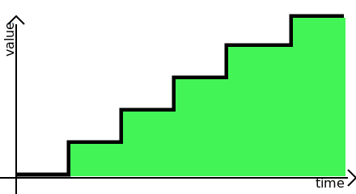
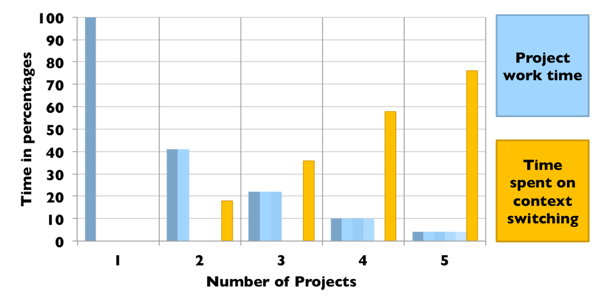
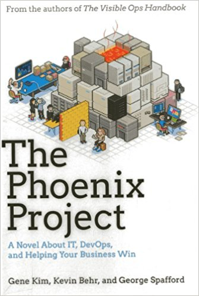
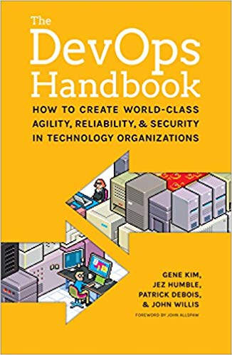
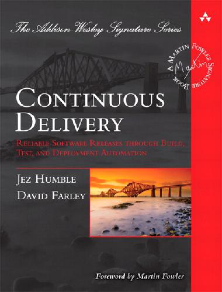

# How to develop software faster and have more stable releases?
{id: index}

## Self introduction
{id: self-introduction}

* [Gábor Szabó](https://www.linkedin.com/in/szabgab/) @szabgab
* Help organizations generate value faster in a sustainable way.
* [Code Mavens Meetup](https://www.meetup.com/Code-Mavens/)

## Goal of the company / organization
{id: goal-of-the-company}

## Goal of the company / organization
{id: goal-of-the-company-2}

* More value to customer
* More money to the shareholder

## Goals of employees
{id: goal-of-employees}


## Goals of employees
{id: goal-of-employees-2}

* Autonomy
* Mastery
* Purpose

* Location. (Close to home)
* Good salary.
* Job stability.
* Interesting, Professional challenge.
* Add value - make a contribution to something valuable.
* Learn new things that will also be valuable at another company.
* Enjoy their time at work (no late hours, no tension).
* Working with nice people.
* Having a good manager.
* Being in the loop.
* Being respected, acknowledged and recognized.
* Working without wasting efforts. (More effective)
* Good hardware and software and office environment.

## Goals - Contradiction?
{id: goals}

* Satisfied engineers create more value.

## Business needs for change
{id: business-needs-for-change}

* Reduce time to market
* Increase feature throughput

* Decrease cost
* Increase quality


## Value creation - Time is Money
{id: time}

* The sooner the better.

* Getting USD 1,000,000 ten years from now is great.
* Getting it one year from now is much better.
* Getting it next week is even better than that.
* NPV Net Present Value

So "sooner" has a higher value than later.


## How to Faster, Cheaper, Better?
{id: what-is-the-solution}

* Lean
* Agile
* Scrum
* Kanban
* FAST
* SAFe
* Spine
* XP
* DevOps
* DevSecOps

## Value creation
{id: value-creation}





## Product types
{id: product-types}

* How frequently are they upgradable?

* Hardware
* Embedded software
* On-premise application/device
* Desktop Application
* Mobile Application
* Web Application

## Fast or stable?
{id: fast-or-stable}

* Need long QA cycle to have stable product.

* Development vs. Operations.

## Release frequency

{id: release-frequency}


* [source](https://medium.com/data-ops/releasing-new-analytics-every-second-fc5fefd92360)

## Deploy per day VS value  (Value creation)
{id: deploy-per-day-vs-value}

* More value sooner
* Faster feedback
* Can the clients acctually absorb the changes?
* Can we deliver the frequent changes?
* How can we ensure the quality remains high or even increases?

## MTTR - Mean time to repair
{id: mttr}

* The more frequent we can release the sooner we can fix issues

## Old model
{id: old-model}

* Waterfall with Big Bang release

* Requirements (clients)
* Design
* Development: many months
* QA: several months, bugs, rework, etc
* Operations
* Information Security

## Wall of Confusion
{id: wall-of-confusion}


by Andrew Clay Shafer.

* [source](http://dev2ops.org/2010/02/what-is-devops/)

## The business cost
{id: the-business-cost}

* Wasted time, cost fixing bugs.
* Low of customer trust due to bugs.
* Long development time.
* Fear of release.

## The human cost
{id: the-human-cost}

* Long working hours.
* Reduced quality of life.
* Powerless in the organization.
* Low employee satisfaction.
* High turnover rate.

## High Performing organizations
{id: hight-performing-organizations}

* **Multiple deploys per day** vs. one per month
* **Commit to deploy in less than 1 hour** vs. one week
* **Recover from failure in less than 1 hour** vs. one day
* **Change failure rate of 0-15%** vs. 31-45%

* [source](https://puppet.com/resources/whitepaper/state-of-devops-report) Puppet labs report

## High Performing organizations
{id: hight-performing-organizations-business}

* **2.5x more likely to exceed business goals**
* Profitability
* Market share
* Productivity

* [source](https://puppet.com/resources/whitepaper/state-of-devops-report) Puppet labs report


## Getting faster
{id: getting-faster}

```
Release once a year  ==============> Amazon speed (more than 1 per second)
```

* Priorities
* Small Batch size
* Reduce Multitasking
* Architecture
* Automated Tests
* Refactoring
* Build only what you need
* Create fast feedback loop

## Priorities
{id: priorities}

* Instead of building 5 features - one feature each person
* Build 2-3 features first and when you are done build the remaining feature.

```
1 =============>
1 =============>
1 =============>
1 =============>
1 =============>
```

```
2 ======>
2 ======>
1 =============>
2        ======>
2        ======>
```

* You get some value (and feedback) earlier.
* Incremental delivery.

## Small Batch size
{id: small-batch-size}

Example: fill envelops - you have 10 envelops to fill with a letter. You have 4 steps

* Fold the letter.
* Put the letter in the envelop.
* Write the address on the envelop.
* Seal the envelop.

## Reduce Multitasking
{id: reduce-multitasking}



* [source](http://flowa.fi/blog/2014/10/23/games-to-learn-kanban-why-and-how.html)

## Multitasking Exercise
{id: multitasking-exercise}

Exercise: Write down 3 sets of values while measuring the time to get the following results:

```
0  1   2  3  4   5    6     7   8  9
a  b   c  d  e   f    g     h   i  j
I II III IV  V  VI  VII  VIII  IX  X
```

First time write these horizontally:

* First write down the Arabic numbers.
* Then the Latin letters
* Then the Roman numbers.

In the next round write the same ones down, but this time start by writing down the first value of each, then the second value of each. (So you'd first write down 0, a, I, then 1, b, II etc.)

Observe how much longer the second method takes.

## Build only what you need
{id: build-only-what-you-need}

* When asked to add a feature, first try to figure out Why? What is the problem that needs to be solved?
* If possible use an existing tool or service. (Open Source, Cloud)
* Focus on building what you really need.


## Create fast feedback loops
{id: fast-feedback-loop}

* Learning from mistakes made half a year earlier is costly, painful, and never really happens.
* Learning from mistakes made 10 min ago is much easier and more valuable.

## Feedback Techniques
{id: techniques}

* From the client after a year of development.
* Telemetry: servers, client interaction, errors, failures... Log and monitor everything. 
* Continuous Deployment (CD).
* Code reviews.
* Continuous Integration (CI).
* Build system.
* Test automation (unit and other automated tests).
* Pair programming.
* Mob programming.


## Learn from the mistakes
{id: learn-from-the-mistakes}

* Blameless post mortem. [Etsy Morgue tool](https://github.com/etsy/morgue).
* Learning organization.
* Transform local discoveries into global improvements. ( US navy reactors. )

## Retrospectives
{id: retrospectives}

* After each sprint.
* Once every few weeks.

* Primarily about the process.

## Daily feedback meetings
{id: daily-feedback-meetings}

* What did you finish yesterday?
* What will you finish today?
* What's blocking you? ( What's your red flag? )

## Continuous Integration (CI)
{id: continuous-integration}

* Nightly build?
* Make sure the code is always releasable/deployable.
* Standardized environments. (Development, testing)

## Toyota Andon cord
{id: toyota-andon-cord}

* Swarm and solve problems, build and spread new knowledge.


## Andon cord
{id: andon-cord}


## Test-Driven Development
{id: test-driven-development}

* Tests provide a solid ground.
* More confidence in our changes.
* Tests make better code.
* Tests make better systems (catch bugs earlier).

## Optimizing Developer Effort
{id: optimizing-developer-effort}

Microsoft research shows that developers on a mature code-base spend their time:

* 75% reading code
* 20% modifying code
* 5% writing new code

* [source](https://blogs.msdn.microsoft.com/peterhal/2006/01/04/what-do-programmers-really-do-anyway-aka-part-2-of-the-yardstick-saga/)

## Pair Programming
{id: pair-programming}

* 2 people at the same computer
* Typing time?

## Refactoring
{id: refactoring}

* Clean up the mess!

## Architecture
{id: architecture}

* Monolith good for the startups
* SOA - Service Oriented Architecture
* Conway's law

## Conway's Law
{id: conways-law}

* Mel Conway 1967
* Organization determines architecture.
* Modular system requires modular organization.

## Small Teams
{id: small-teams}

* 2 Pizza team (Jeff Bezos) (Full-service)
* Align to Business Domains

## End-to-end Ownership
{id: end-to-end-ownership}

* You build it, you run it. Werner Vogels  (CTO of Amazon)

The same team

* writes code
* checks quality
* runs the service

* If you are the one who needs to wake up at night for a bug, you will fix it soon.

## Project boundaries
{id: project-boundaries}

* The majority of the work should be inside of each team.

## Design
{id: design}

* Design for both external and internal customers. 
* The external pays for it but the internal also uses it. 
* Optimize for downstream work center. 

## Features
{id: features}

* Testability
* Deployability
* Architecture
* Security
* Performance
* Stability
* Configurability


## Continuous Deployment (CD)
{id: continuous-deployment}

* Repeatable deployment pipeline.

## Decouple deployment
{id: decouple-deployment}

* Decouple deploy from release.
* Decouple delivery from deploy.

* Feature flags.
* Dark launches
* Deployment circles - Canary release - Cluster immune systems
* Blue-green deployment

* AB testing

## Blue-green deployment
{id: blue-green-deployment}

* Decouple changes to the database and changes to the application. 
* Duplicate the whole stack.

## Canary release
{id: canary-release}

* Deploy to only a few servers, monitor
* Enable only to a subset of users, monitor

## Infrastructure as code
{id: infrastructure-as-code}

* Requirements files.
* Vagrant configurations.
* Ansible/Chef/Puppet
* Containers - Docker Images
* Container Orchestration - Kubernetes

## DevOps loop
{id: devops-loop}


* Requirements
* Design / Plan
* Development  / Code
* Build
* InfoSec
* QA
* Release
* Deploy
* Operations
* Monitoring

## Continuous Improvement
{id: continuous-improvement}

* Continuous Improvement.
* Continuous Learning.

This needs investment both time and money and it leads to change. 

## Hierarchy of abstractions
{id: hierarchy-of-abstractions}

* VPS (GCE - Google Cloud Engine)
* Kubernetes (GKE - Google Kubernetes Engine)
* Paas (GAE - Google App Engine)
* Serverless (GCF - Google Cloud Functions)

## Resilience testing
{id: resilience-testing}

* Intentionally cause problems during the work day and see how the tools and the team react.
* Randomly kill processes and compute servers in production to see how the monitoring system and the whole team reacts
* Do this often during work hours and reduce the risk of such thing happening during the nights.
* Fix any issues. Learn.
* [Netflix Chaos Monkey](https://github.com/Netflix/SimianArmy/wiki/Chaos-Monkey)


## What is in there for me, the developer?
{id: what-is-in-there-for-the-developer}

Most engineers I know want to enjoy work and be proud of their accomplishments. 

* Safer work place - no fear of change, no fear of release.
* Better working environment. 
* Much less bugs and rework of the same code. 
* Allow you to do other work when this is done

* Learn new things.
* Learn better development practices that will be relevant in your next job as well.


## The transformation process
{id: transformation-process}

* It can take years.
* We would like to see results soon.

* Top down support.
* Bottom up experimentation, feedback. 

* Get support from the top: VP RnD, CxO.
* Work on team level.

## Theory X and Theory Y
{id: theory-x-and-theory-y}

by Douglas McGregor

* X thinks people are lazy, need supervision.
* Y thinks people can be autonomous if trusted.


* [Theory X and Theory Y](https://en.wikipedia.org/wiki/Theory_X_and_Theory_Y)

## Time boxing experiment
{id: time-boxing-experiment}

* Use time boxing for experimentation to reduce risk and increase chances of acceptance. 

## Greenfield projects VS brownfield projects
{id: brownfield-projects}

Greenfield projects are easier to get started with.

Brownfield projects have:

* Technical debt.
* Legacy code.
* Unsupported platforms.

* Users.

## Getting Started
{id: getting-started}

The two most important aspects are:

* Value Creation
* Feedback

Start with these.

* Discuss the things you value.
* Then build in short feedback loops in your process. 

## Top down approach
{id: top-down-approach}

* Pick the value stream to be the first to convert:
* Start with the team that has the most open attitude to the new way of work. 
* Educate people. Both about the ideas and about the techniques.
* Find the first bottleneck that is in your power to change.
* Reinforce learning culture.
* Instead of adding more people to the team, improve the way the team works.

## Team level approach
{id: team-level-approach}

* Start writing tests.
* For every new feature, for every bug.
* Include time for refactoring.
* Set up Continuous Integration
* Work on standardized environment (Requirements, VMs, Containers)

At first this will take you extra time. Later you will see the value. Put it in the estimates. They are part of your job.

* Allocate at least 20% of your time to this.

## Resources
{id: recommended-books}

Surveys

* [State of Agile](http://stateofagile.versionone.com/).
* [State of DevOps](https://puppet.com/resources/whitepaper/state-of-devops-report) Puppet labs report.

Books


* [The Phoenix project](https://www.amazon.com/Phoenix-Project-DevOps-Helping-Business/dp/0988262592)
* [The DevOps handbook](https://www.amazon.com/DevOps-Handbook-World-Class-Reliability-Organizations/dp/1942788002/)
* [Continuous delivery](https://www.amazon.com/Continuous-Delivery-Deployment-Automation-Addison-Wesley/dp/0321601912/) by Jez Humble and Dave Farley
* [Lean Software Development: An Agile Toolkit](https://www.amazon.com/Lean-Software-Development-Agile-Toolkit/dp/0321150783) by Mary Poppendieck and Tom Poppendieck.
* [The Goal: A Process of Ongoing Improvement](https://www.amazon.com/Goal-Process-Ongoing-Improvement/dp/0884271951) by Eliyahu M. Goldratt and Jeff Cox.
* [Lean Thinking: Banish Waste and Create Wealth in Your Corporation](https://www.amazon.com/Lean-Thinking-Corporation-Revised-Updated/dp/0743249275) by James P. Womack and Daniel T. Jones.
* [The Fifth Discipline: The Art & Practice of The Learning Organization](https://www.amazon.com/Fifth-Discipline-Practice-Learning-Organization/dp/0385517254) by Peter M. Senge.
* [Beyond Legacy Code](https://pragprog.com/book/dblegacy/beyond-legacy-code) by David Scott Bernstein.
* [Switch: How to Change Things When Change Is Hard](https://www.amazon.com/Switch-Change-Things-When-Hard/dp/0385528752) by Chip Heath and Dan Heath
* [Drive: The Surprising Truth About What Motivates Us](https://www.amazon.com/Drive-Surprising-Truth-About-Motivates-ebook/dp/B004P1JDJO) by Daniel H. Pink

Videos

* [Velocity and volume (or speed wins)](https://www.youtube.com/watch?v=wyWI3gLpB8o) Adrian Cockcroft.
* [Moving Fast At Scale](https://www.youtube.com/watch?v=oH4g7wLPqg4) video by Randy Shoup.
* [Moving Fast At Scale](https://www.slideshare.net/RandyShoup/moving-fast-at-scale) slides by Randy Shoup.

Blog posts

* [No, You are not Dumb! Programmers do spend a lot of time Understanding Code...](http://blog.architexa.com/2010/05/no-you-are-not-dumb-programmers-do-spend-a-lot-of-time-understanding-code/) links to surveys.
* [How Software Developers Really Spend Their Time](https://readwrite.com/2013/04/25/how-software-developers-really-spend-their-time/) 
* [You're Doing Scrum Wrong, and Here's How to Fix It](https://hackernoon.com/youre-doing-scrum-wrong-and-here-s-how-to-fix-it-6d45fdd26721)

* [Manifesto for Agile Software Development](http://agilemanifesto.org/)

* [Canary Release](https://martinfowler.com/bliki/CanaryRelease.html)


* [Ron Jeffries Says Developers Should Abandon "Agile"](https://www.infoq.com/news/2018/06/developers-should-abandon-agile)
* [Developers Should Abandon Agile](https://ronjeffries.com/articles/018-01ff/abandon-1/) by Ron Jeffries.

* [What do software engineers want from their jobs?](https://www.quora.com/What-do-software-engineers-want-from-their-jobs)

## Contact me
{id: contact-me}

* [Gábor Szabó](https://www.linkedin.com/in/szabgab/) @szabgab


## Sources
{id: sources}

http://www.shmula.com/about-peter-abilla/what-is-andon-in-the-toyota-production-system/

http://www.shmula.com/andon-system-what-does-it-tell-you/20584/






